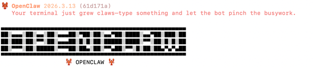
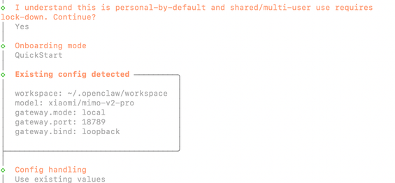
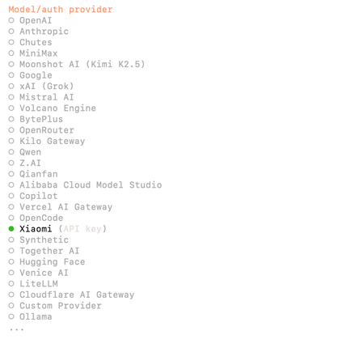
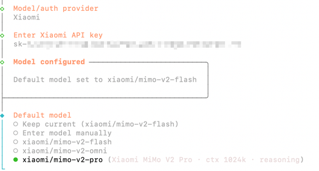
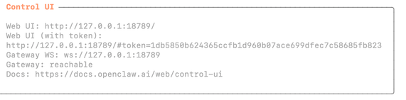
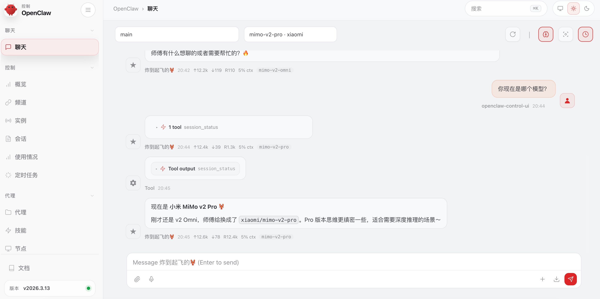

# OpenClaw 

## 安装 OpenClaw

### 前置条件：[Node.js 22 或更新版本](https://nodejs.org/en/download/)

一般来说，linux自带Node.js22 以上版本，Windows版本随系统变化查看当前 Node\.js 版本（两个系统通用）

查看是否有node.js，linux和Windows，**命令完全一样**：

```bash
node -v
# 或者
node --version
```

- 执行后会输出：`vxx\.xx\.xx`（例如 `v20\.10\.0`）
- 如果提示`不是内部或外部命令`，说明**没安装 Node\.js** 或**没配置环境变量**

#### Windows 系统 安装 Node\.js 22 版本

方法 1：官方安装包（最简单、最推荐）

1. 打开官网：[https://nodejs\.org/download/release/v22\.0\.0/](https://nodejs.org/download/release/v22.0.0/)

2. 下载：`node\-v22\.0\.0\-x64\.msi`

3. 双击安装 → 一路下一步 → 安装完成

4. **重启终端**（CMD/PowerShell），执行 `node \-v` 验证

方法 2：命令行一键安装（winget）

Windows 10/11 自带包管理器，直接运行：

```bash
winget install OpenJS.NodeJS.22
```

---

#### Linux 系统 安装 Node\.js 22 版本

最通用、最稳定方法（官方源，支持 Ubuntu/Debian/CentOS）

**一行命令直接安装 Node\.js 22**：

```bash
curl -fsSL https://deb.nodesource.com/setup_22.x | sudo -E bash -
sudo apt-get install -y nodejs
```

验证安装

```bash
node -v
npm -v
```

---

### 安装openclaw

macOS/Linux：

```bash
curl -fsSL https://openclaw.ai/install.sh | bash
```

Windows (PowerShell)：

```bash
iwr -useb https://openclaw.ai/install.ps1 | iex
```



由于笔者的项目倾向于小米的模型，故配置模型，选用小米的，读者要更具自己所需自由选择模型，各个模型大差不差，
并未高低之分。

### 配置 MiMo 模型

#### 方法1：交互式配置向导

安装完成后，将自动开始配置过程。您也可以运行以下命令开始配置：

```bash
openclaw onboard --install-daemon
```

**1. 配置供应商**





- I understand this is personal-by-default and shared/multi-user use requires lock-down. Continue? ➡️ Yes
- Onboarding mode ➡️ QuickStart
- Config handling ➡️ Use existing values
- Model/auth provider ➡️ Xiaomi

**2.** **配置模型和 API Key**



**3.** **继续完成后续配置**

- Select channel ➡️ 选择您需要的渠道
- Configure skills ➡️ 安装您需要的 skills
- 完成设置

**4.** **测试机器人**

- How do you want to hatch your bot? ➡️ 可在 TUI/Web UI 中和机器人对话
  - TUI：输入 `openclaw tui`，若成功对话则表示配置成功


- Web UI：通过打开终端中显示的 `Web UI (with token)` 链接来访问 Web UI





#### 方法2：修改配置文件

在 `~/.openclaw/openclaw.json` 添加模型，并修改 agent 的默认模型即可。
以下仅供参考，不代表最新最新json文件，**你只需要把前面标题一样的修改就行，不要替换整个json**

```json
{
  "models": {
    "mode": "merge",
    "providers": {
      "xiaomi": {
        "baseUrl": "https://api.xiaomimimo.com/v1",
        "apiKey": "",
        "api": "openai-completions",
        "models": [
          {
            "id": "mimo-v2-pro",
            "name": "mimo-v2-pro",
            "reasoning": true,
            "input": [
              "text"
            ],
            "contextWindow": 1048576,
            "maxTokens": 32000
          },
          {
            "id": "mimo-v2-omni",
            "name": "mimo-v2-omni",
            "reasoning": true,
            "input": [
              "text",
              "image"
            ],
            "contextWindow": 262144,
            "maxTokens": 32000
          }
        ]
      }
    }
  },
  "agents": {
    "defaults": {
      "model": {
        "primary": "xiaomi/mimo-v2-pro"
      },
      "models": {
        "xiaomi/mimo-v2-omni": {},
        "xiaomi/mimo-v2-pro": {}
      },
    },
  },
}
```

### 接入飞书教程

https://cloud.tencent.com/developer/article/2626160   （【保姆级教程】手把手教你安装OpenClaw并接入飞书，让AI在聊天软件里帮你干活）

### 龙虾常用指令

以下是**OpenClaw（龙虾）** 高频、实用的指令，覆盖会话管理、模型切换、服务控制、配置与调试等场景，直接复制即可使用。

---

#### 一、会话与基础控制（/ 开头，不耗 Token）

- `/new`：开启全新会话，清空当前上下文，**节省 Token**

- `/status`：查看当前会话状态（模型、会话 ID、连接情况）

- `/clear`：清空当前会话历史（保留会话，仅删除对话记录）

- `/exit`：退出当前会话，关闭连接

---

#### 二、模型管理（多模型切换）

- `/models`：列出所有已配置的可用模型（含名称、类型、状态）

- `/model 模型名`：切换到指定模型（如 `/model gpt\-4o`）

- `/model`：查看当前正在使用的模型

以上可以在对话框里与龙虾使用，以下需要在终端里使用

---

#### 三、服务与网关控制（本地 / 服务器部署）

- `openclaw gateway start`：启动网关服务（核心，连接 AI 与客户端）

- `openclaw gateway stop`：停止网关服务（升级 / 改配置前用）

- `openclaw gateway restart`：重启网关（修改配置后必用，使新配置生效）

- `openclaw gateway status`：查看网关运行状态（是否在线、端口、连接数）

- `openclaw logs \-\-follow`：实时查看日志（排查问题必备）

---

#### 四、配置与部署（初始化 / 自定义）

- `openclaw onboard`：启动本地部署向导（配置 API、端口、模型）

- `openclaw config set 键 值`：修改配置项（如 `openclaw config set port 18789`）

- `openclaw config get 键`：查看配置项（如 `openclaw config get api\_key`）

- `openclaw config list`：列出所有配置项

---

#### 五、实用快捷指令（直接发送）

- 总结内容：`总结这段内容，列出3条核心要点`

- 格式转换：`把内容整理成表格/列表/Markdown格式`

- 文本提取：`提取图片/文件中的文字`

- 翻译：`翻译以下内容，保持原意`

- 待办生成：`把内容转为待办清单，标注时间与优先级`

---

#### 六、Linux/Windows 通用操作（部署后）

- 启动服务：`openclaw start`

- 停止服务：`openclaw stop`

- 查看版本：`openclaw \-\-version`

- 安装依赖：`npm install openclaw \-g`（全局安装）

