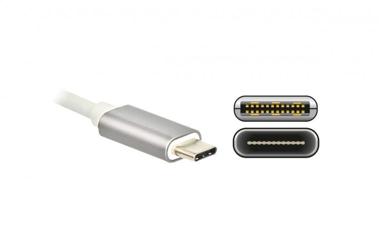

# 理工科计算机基础指北


在计算机里头没有任何黑魔法，所有的东西只不过是我现在不知道而已，总有一天我会把所有的细节，所有的内部的东西全都搞明白。


## 开源声明

© \[2026\] \[Edge\]

本作品采用知识共享 署名\-非商业性使用\-相同方式共享 4\.0 国际许可协议（CC BY\-NC\-SA 4\.0）进行许可。
要查看该许可协议的完整内容，请访问 https://creativecommons\.org/licenses/by\-nc\-sa/4\.0/deed\.zh


## 版本说明

版本（1\.2\.0）为笔者利用寒假时间，对原有内容进行了补充，对于各位同学可能遇到的新问题进行了补充修改。

本版本（1\.2\.1）为笔者在本学期（2025\-2026学年第二学期）在1\.2\.0版本上持续修改补充得来，感谢在补充过程中的各位同仁的帮助。

## 【前言】

### 1\. 为什么会有这份《指北》？

许多新同学在初入实验室时，由于初高中微机课的缺乏，计算机基础薄弱，甚至不知道Ctrl键的位置，这严重影响了后续的培训和学习进度。为了帮助大家快速弥补这些知识断层，我们编写了这份《指北》。

### 2\. 本指南是什么？

这是一份以 Windows 11 为主、Ubuntu 为辅的《计算机基础指北》。它完全面向日常学习和科研的实际操作，旨在帮你快速上手，弥补知识与技能断层。请注意，它的定位与大学的《计算机基础》课程不同，不要觉得看完这本书后，就可以拒绝上《计算机基础》课。

### 3\. 邀请你一同完善

本指南行文力求亲切易懂，便于各位同学快速上手。若您在阅读中发现任何疏漏或错误，非常欢迎批评指正，我们将持续完善。

**适用说明**：
本指南默认读者未来可能进入计算机 / 自动化 / 信息相关实验室；对于文科学生只需浅显了解基础部分即可，无需死磕；读者对于不理解或者暂时用不上的地方可以跳过。

# 第一章 认识计算机

**前言**：当同学们看到此书时，笔者默认大家具有打开电脑，阅读docs或者pdf的能力，故不过多赘述，以下内容主要认识打开计算机后，可以看到的东西，例如键盘，桌面应用图标等等。

## 第一节: 外接设备与接口认识

外接设备与接口认识：为你的电脑连接整个世界。作为实验室成员，你不可避免地要连接各种设备：传输数据的U盘、扩展屏幕的显示器、读取素材的SD卡、以及至关重要的网线。认识这些接口，是你高效使用电脑的第一步。

### 一、 数据传输接口：电脑的“进出口”

接口主要负责连接存储设备和其他外设，进行数据交换。

1. **USB接口家族**：最常见的“万金油”

    - 核心功能：连接键盘、鼠标、U盘、移动硬盘、手机、摄像头等几乎一切外设。

    - 识别与选择：

        - USB\-A型：经典方口，插取需尝试，最常见但速度有差异。

        

        - USB\-C型：小巧椭圆形接口，正反可插，是现在的主流和未来；很多电脑的USB\-C口同时是充电口和视频输出口。

        

    - 实验室建议：传大文件（如数据集、模型）时，优先使用USB\-C口或蓝色的USB\-A口；新电脑仅USB\-C口时，需配备USB\-C to A转接线或扩展坞。

2. **雷电接口**

    - 外形：通常为USB\-C物理形态，旁有闪电⚡标志。

    - 特点：速度极快、功能极强，可外接高性能显卡坞和高速硬盘阵列，是“超级加强版”USB\-C。

3. **SD / TF 卡读卡槽**

    - 外形：笔记本侧面扁平缝隙（部分电脑无）。

    - 功能：直接读取相机、无人机等设备存储卡的素材。

### 二、 显示输出接口：为你开启更多“视野”

实验室工作多屏可提升效率，常见视频接口优先级从高到低：

1. **HDMI**：外形类似USB\-A更宽，梯形设计不插反；最普及通用，显示器、投影仪、电视均适配，一根线同时传视频和音频。

    

2. **DisplayPort**：外形类似HDMI，一角直角一角切角；性能通常优于HDMI，是电脑显示器领域主流，同样传视频和音频。

    

3. **VGA**：蓝色带两排针脚的梯形接口；老旧模拟信号接口，画质差、不支持音频，实验室原则为非万不得已不使用，仅适配老设备时需转接线。

    


**实验室实战场景**：笔记本仅一个HDMI口想接两台显示器，可通过USB\-C或雷电接口的扩展坞，扩展出多个HDMI/DP接口，同时可接网线、U盘等。

### 三、 有线网络接口：稳定可靠的“信息高速公路”

- RJ\-45 网线接口：形似大型电话线插口。

- 重要性：稳定性优于Wi\-Fi，不掉线、延迟低；相同网络条件下，网速快于WiFi。


### 四、 音频接口

- 台式机：两个接口，分别为麦克风图标（接耳机麦克风）、耳机图标（接耳机/音箱）。

- 笔记本：耳机/麦克风二合一接口。


> **Little tip：在现在的笔记本和主板维修成本较高的前提下，笔者建议大家买一个较高性能的拓展坞，因为拓展坞不仅仅可以减轻对与电脑原接口的物理磨损还有就是高品质拓展坞内部会设计有保护电路和芯片。当某个外接设备（比如劣质的U盘、移动硬盘）发生短路或电流异常时，保护电路会首先动作（如切断该端口的供电），阻止异常电流直接冲击笔记本主板**
> 
> 


## 第二节：键盘篇：你的双手，就是最高效的快捷键

作为计算机领域从业者，键盘是与计算机“直接对话”的通道，熟练使用能脱离繁琐点击，提升效率。

### 一、 键盘分区：你的指挥中心


1. **主键盘区**

    - 核心：字母、数字、符号键，是输入代码、文档、命令的主力。

    - 修饰键（操作灵魂，多与其他键组合）：

        - Ctrl：控制键，快捷键核心（如Ctrl \+ C/V），位于键盘左下/右下。

        - Alt：替代键，Windows中激活菜单，参与大量软件快捷键。

        - Shift：上档键，输入大写字母和键位上方符号。

        - Win：Windows键，印Windows徽标，快速打开开始菜单（Ubuntu中为Super键，功能类似）。

2. **功能键区**：顶部F1 \~ F12，功能因软件而异，为“情景快捷键”；实验室高频用法：F2（文件重命名）、F11（浏览器/IDE全屏）、F5（刷新/运行/调试代码）。

3. **导航键区**：含方向键和Insert、Delete、Home、End、Page Up、Page Down；写代码高频用法：Home/End（光标跳至行首/行尾）、Ctrl \+ Home/End（光标跳至文档开头/结尾）、Page Up/Page Down（翻页）。

4. **数字小键盘区**：快速输入数字，处理数据便捷；Num Lock键灯亮输数字，灯灭为导航键。

### 二、 实验室生存必备快捷键（肌肉记忆系列）

#### 通用核心操作（Win \&amp; Ubuntu 通用）

- Ctrl \+ C：复制

- Ctrl \+ V：粘贴

- Ctrl \+ X：剪切

- Ctrl \+ Z：撤销（误操作“后悔药”）

- Ctrl \+ Y 或 Ctrl \+ Shift \+ Z：恢复

- Ctrl \+ S：保存（高频操作，对抗程序崩溃）

- Ctrl \+ A：全选

#### 文本/代码编辑专用

- Ctrl \+ F：查找

- Ctrl \+ H：替换

- Shift \+ 方向键：以字符/行为单位选中文本

- Ctrl \+ 方向键左/右：以词为单位移动光标

- Ctrl \+ Backspace / Ctrl \+ Delete：以词为单位删除

- **特殊标注，由于linux出现较早，ctrl\+C/V在诞生时便被赋予了中断信号/逐字输入的特殊含义，所以，复制和粘贴在终端中为Ctrl\+Shift\+C/V**

#### 系统与窗口管理

- Alt \+ Tab：应用程序间快速切换

- Win \+ D：一键显示桌面

- Win \+ E：快速打开文件资源管理器

- Win \+ L：瞬间锁屏

- Alt \+ F4：关闭当前活动窗口

- ctrl \+ 鼠标滚轮：浏览器/Word/代码编辑器中放大/缩小字体（在部分IDE中需要单独设置）

#### Ubuntu 特色补充

- Super键：按一下打开活动概览，快速搜索和启动应用

- Ctrl \+ Alt \+ T：快速打开终端（核心快捷键）

### 三、 指法建议

我们不是专业打字员，不要求盲打。但请尽量让双手放在键盘上，尤其是左手，应该常驻在 Ctrl, Alt, Shift 这几个修饰键周围。这样当你需要按快捷键时，右手可以继续操作鼠标或按其他键，效率倍增。

## 第三节：认识计算机硬件：你的算力引擎

你可以把电脑主机想象成一个实验室团队，每个硬件部件都是团队中的一名成员，各司其职，协同完成复杂的计算任务。

理解各个设备的作用，在你选购电脑时便会有自己的想法和见解。

### 一、 CPU：团队的“总指挥”

- 定义：中央处理器，电脑“大脑”，执行程序指令、处理数据、协调其他硬件工作。

- 核心比喻：实验室“博后”/“导师”。

- 关键指标：

    - 核心数：可同时独立处理任务的数量，核心越多并行能力越强。

    - 线程数：超线程技术下，单个核心可同时处理的任务数，线程数越多并行能力越强。

    - 频率：单位GHz，频率越高单个任务处理速度越快。

- 实验室场景：负责程序逻辑控制、数据预处理、大部分科学计算（无GPU时）；任务管理器中CPU核心接近100%时，为计算性能瓶颈。


### 二、 GPU：团队的“大规模并行计算兵团”

- 定义：图形处理器，最初为处理图像设计，现是大规模并行计算专家。

- 核心比喻：实验室“大量研究生”。

- 关键指标：CUDA核心/流处理器（数量极多，单个核心能力弱于CPU，但擅长简单重复的并行任务）；**显存**（GPU专属工作内存，模型/数据/中间结果需存入，显存不足程序报错，深度学习中显存比核心数更重要）。

- 实验室场景：深度学习模型训练与推理（矩阵运算拆分并行计算，速度远快于CPU）、科学计算与仿真（多库支持GPU加速）。

**CPU vs\. GPU 核心区别**：CPU是少数“博后”，能力全面，负责复杂逻辑和任务调度；GPU是成千上万个“研究生”，擅长简单重复的大规模并行计算。


### 三、 内存：团队的“公共实验台”

- 定义：随机存取存储器，CPU的“临时工作区”。

- 核心比喻：实验室“中央实验台”；所有运行的程序、打开的数据需先从硬盘加载到内存，CPU才能操作。

- 特点：速度快，断电后数据丢失。

- 实验室场景：加载大数据集时占用大量内存；内存占满时系统卡顿（调用硬盘虚拟内存，速度慢）。

- 建议：机器学习/深度学习电脑，16GB为起步，32GB及以上为推荐；主流为DDR4/DDR5（互不兼容，防呆口位置不同），预算允许优先DDR5平台。


### 四、 硬盘：团队的“资料档案馆”

- 定义：长期存储操作系统、软件、文档、数据的设备，断电后数据不丢失。

- 核心比喻：实验室“档案柜”/“仓库”。

- 两种类型：

    1. **机械硬盘**：有机械臂和磁碟；优点为便宜、容量大，适合冷数据备份；缺点为速度慢、怕震动。

    

    2. **固态硬盘**：纯电子结构，无机械部件；优点为读写速度极快、抗震；缺点为价格较高（AI行业需求激增导致价格翻倍）。

    

- 实验室建议：系统、软件、当前项目装在SSD（提升开机、打开软件、加载数据速度）；机械硬盘存储历史数据、备份、视频等对速度无要求的文件。

### 五、 主板：团队的“办公楼”

- 定义：带各类插槽和接口的电路板，为硬件提供电源、网络和安装位置，实现硬件间通信协作。

- 关键作用：决定扩展性（GPU/内存/硬盘接口数量，影响后续升级）；芯片组决定支持的CPU型号、最大内存速度等。


### 六、 电源：团队的“能源中心”

- 定义：为所有硬件提供稳定、纯净电力的设备。

- 核心比喻：实验室“供电系统”，至关重要却易被忽视。

- 风险：劣质/功率不足的电源会导致电脑不稳定、蓝屏、重启，甚至烧毁CPU/GPU等贵重部件。

- 建议：千万不要在电源上省钱。为高性能电脑（尤其是有独立GPU的）选择一个功率足够、品牌可靠的电源。

特殊说明:**对于绝大部分游戏本和一小部分轻薄本能插电使用一定要插电使用！电池的作用只是为了让你面对意外断电应急使用**

### 实验室硬件选购与使用小贴士

1. **查看电脑配置**

    - Windows：任务管理器 \-\&gt; “性能” 选项卡。

    - Ubuntu：lscpu（CPU）、nvidia\-smi（GPU）、free \-h（内存）、lsblk（硬盘）。

2. **判断性能瓶颈**：做任务时通过任务管理器（Windows）/htop（Ubuntu）查看：

    - CPU 100% \-\> 计算瓶颈

    - 内存 100% \-\> 内存瓶颈（加内存/优化代码）

    - GPU 使用率低 \-\> 数据传输慢/代码问题（非GPU瓶颈）

    - 硬盘灯常亮\+系统卡顿 \-\> 硬盘读写瓶颈（升级SSD）

3. **新生选购优先顺序**：GPU（显存） 优先\>内存 \> SSD \> CPU \> 其他；深度学习NVIDIA GPU\>其他；确保主板支持CPU/内存，电源满足系统峰值功耗。

## 第四节:Windows 11 初体验：桌面、开始菜单、任务栏是什么？

将Windows 11界面拆解为桌面、开始菜单、任务栏，类比实验室工位的桌面、工具抽屉、顺手工具架。

### 一、 桌面：你的工作台面

- 定义：开机后看到的主背景区域，类比实验室物理桌面。

- 功能：放置常用软件/文件夹/文件快捷方式；暂存U盘/下载的临时文件；右键“个性化”更换壁纸。

- 实验室潜规则：不堆满图标（降低效率）；重要文件不长期存放（默认在C盘，系统崩溃易丢失，及时归档至D盘等）；

快捷方式正如上面所说，是软件或者文件快速打开的方法，将其直接拖入回收站是无法删掉文件或者软件的。

### 二、 开始菜单：你的应用程序库与控制中心

- 打开方式：点击任务栏正中Windows徽标按钮。


- 核心区块：

    1. “已固定”区域：上半部分，自定义“神器收藏夹”，右键软件可“固定到开始屏幕”。

    2. “所有应用”列表：点击按钮查看，电脑所有程序按字母排序，用于查找软件。

    3. 推荐区域：下半部分，显示最近打开的文件和新安装应用，快速找回工作内容。

- 实验室高效技巧：按Win键直接键入软件名（如code找VS Code），回车启动，比鼠标操作快十倍；将开发环境和常用工具固定到“已固定”区域。


### 三、 任务栏：你的多任务管理中心

- 定义：屏幕底部含开始菜单、搜索、程序图标、时间的长条，实时显示工作状态。

- 核心作用：

    1. 程序坞：右键程序可“固定到任务栏”，实现一键启动。

    2. 运行中程序“码头”：运行的程序在任务栏有图标，点击可切换。

    3. 系统状态查看：右下角可查看/调整网络、音量、电池；点击日期时间弹出通知中心/日历；点击网络等图标弹出快速设置（调整Wi\-Fi、蓝牙等）。

- 实验室高效技巧：点击“任务视图”图标（或Win \+ Tab），可查看所有打开窗口、新建虚拟桌面；虚拟桌面可按工作场景划分（如写代码、查资料、沟通），通过Ctrl \+ Win \+ 左/右方向键快速切换。


## 第五节：Ubuntu 初体验：进入开源世界的命令行圣殿

当你选择进入 Ubuntu 系统后，首先迎接你的通常是一个简洁、现代的桌面环境。别被它的平静外表迷惑，其下蕴藏着强大的力量。对于一个励志成为优秀程序员的你来说，Ubuntu 是你未来与服务器、高性能计算和纯命令行环境打交道的基石。

### 一、 桌面与环境：似曾相识，又与众不同

由顶栏、程序坞、活动概览组成：

1. **顶栏**：屏幕顶部，类似Windows任务栏\+菜单栏；左侧为活动按钮，中间为当前程序菜单，右侧为系统状态区（网络、声音等）。

2. **程序坞**：默认屏幕左侧，快速启动栏；点击打开应用，打开程序后右键可“添加到收藏夹”；实验室核心固定：文件、终端、文本编辑器。

3. **活动概览**：打开方式为点击顶栏“活动”按钮/按Super键；可平铺所有打开窗口，左侧为程序坞，顶部为全局搜索框；高效技巧：Super键\+输入内容（应用名、文件名、计算式），快速搜索启动。


### 二、 文件管理器：你的数据导航员

- 打开方式：点击程序坞“文件”图标/Super键搜索“Files”，即Ubuntu的“我的电脑”。

- 重要概念：

    - 家目录：打开后默认进入，对应Windows的C:\\Users\[用户名\]，个人文档/下载等默认存放于此。

    - 根目录：左侧“其他位置”\-\>“计算机”，对应Windows的C:\\，所有硬盘/U盘/网络驱动器“挂载”至根目录下文件夹（如/media），无盘符区分。

- 实验室潜规则：路径用正斜杠/（Windows为反斜杠\\），家目录路径为/home/用户名/；

**Ubuntu中“万物皆文件”。**

### 三、 终端：你与机器对话的“魔法窗口”

1. **学习必要性**：服务器无图形界面，全靠终端操作；开发工具配置、软件安装，终端命令更高效强大。

2. **打开方式**：快捷键Ctrl \+ Alt \+ T（核心）；Super键搜索“terminal/终端”。

3. **生存级初体验**：打开后命令行以**用户名@电脑名:\~$** 结尾，常用命令：

    - pwd：查看当前所在文件夹（Print Working Directory）

    - ls：列出当前文件夹的文件/子文件夹（List）

    - cd 文件夹名：切换目录（Change Directory）

    - cd \.\.：返回上一级目录

    - cd \~ 或 cd：回到家目录

### 四、 软件安装：全新的“应用商店”体验

Ubuntu安装软件主要为以下两种方式，实验室主流为命令行：

1. **图形化方式**：Ubuntu Software，类似手机应用商店，搜索安装，缺点为版本更新较慢。

2. **命令行方式（apt命令）**：Ubuntu自带软件管理器，优势为一键操作、自动解决依赖：

    - 更新软件源列表：sudo apt update（sudo获取管理员权限，需输入密码）

    - 安装软件：sudo apt install 软件包名

    - 示例（安装VS Code）：

sudo apt update
sudo apt install code

**结语**：初次接触 Ubuntu，不必追求掌握所有细节。请先熟悉图形界面的操作，并勇敢地打开终端，把上面几条生存命令当成咒语一样敲几遍。感受这种直接、高效的交互方式。很快你就会发现，这个“黑色窗口”是你最得力的助手。

## 第六节：常见的文件格式：你的数字文件百科全书

文件扩展名（后缀）是文件的“姓氏”，标识性质和用途，**重点记忆**：\.pdf / \.docx / \.xlsx / \.txt / \.md / \.zip / \.exe，其他按需查阅。

### 一、 文档与文本类

**实验室提示**：

与他人分享最终版文档时，优先使用 PDF，以确保对方看到的和你一模一样。

写项目说明文档（README）时，强烈推荐使用 Markdown（\.md）。

技术就是个圈，在笔者在审阅终稿时，头部ai公司，又开始使用HTML了，所以同学们按需所学就好\.

### 二、 数据与存储类

#### （一）演示与表格类（补充）

#### （二）数据交换与存储类

#### （三）压缩与打包类

**实验室提示**：小型通用表格数据用CSV；大型矩阵/模型权重用NPY/NPZ或HDF5；不使用Word/Excel保存程序计算的原始数据，优先用CSV等纯文本格式。

### 三、 代码与程序类

### 四、 图像与多媒体类

**实验室提示**：保存照片用JPG；保存算法图表、示意图、透明背景图片用PNG。

**总结（之最）**：

- 最通用的文档：\.pdf

- 最通用的数据：\.csv

- 最通用的压缩包：\.zip

- 最通用的图片：\.jpg \(照片\) 和 \.png \(图表\)

- 最通用的代码：\.py / \.ipynb \(Python环境\)

## 第七节 如何卸载软件（真正意义上）

### 一、Windows 下卸载软件

#### 正确方法：通过系统设置卸载

1. 按 `Win + I` 打开设置。

2. 点击左侧 "应用" → "已安装的应用"。

3. 找到要卸载的软件，点击右侧三个点 `···` → "卸载"。

4. 按提示完成卸载。

#### 更彻底的方法：使用专业卸载工具

系统自带卸载有时会留下残余文件和注册表项。推荐使用：

- Geek Uninstaller（免费、免安装、体积小）

    - 打开后右键软件 → "强制删除"，会自动扫描残留文件和注册表项，一键清理干净。

- HiBit Uninstaller（功能更全面）

#### 绝对不要做的事

> 记住：快捷方式 ≠ 软件本身。就像撕掉药瓶上的标签，药还在瓶子里。
> 
> 

---

### 二、Ubuntu 下安装软件

Ubuntu 安装软件主要通过命令行，这也是 Linux 的主流方式。不要害怕——掌握几条命令就足够。

#### apt：最核心的包管理器

apt 是 Ubuntu 自带的软件管理工具，绝大多数软件都可以通过它安装。

```text
# 更新软件源列表（安装前先执行，确保获取最新版本信息）
sudo apt update
# 安装软件
sudo apt install 软件包名   
# 示例
sudo apt install git          # 安装 Git
sudo apt install vim          # 安装 Vim 编辑器
sudo apt install build-essential  # 安装 C/C++ 编译工具链（gcc、g++、make）
```

> `sudo` 是什么？`sudo` = Super User Do，以管理员权限执行命令。输入后系统会要求输入密码（输入时屏幕上不会显示任何字符，这是正常的安全行为，输完按回车即可）。

#### 从 \.deb 安装包安装

有些软件（如 Google Chrome、WPS Office）不收录在 apt 源中，官网提供 `.deb` 安装包：

```text
# 下载 .deb 文件后，在终端进入文件所在目录，执行：
sudo dpkg -i 文件名.deb
# 如果报依赖错误，再执行一次：
sudo apt install -f    # 自动修复依赖关系
```

#### 其他安装方式（了解即可）

### 三、Ubuntu 下卸载软件

```text
# 普通卸载（保留配置文件）
sudo apt remove 软件包名
# 彻底卸载（同时删除配置文件，推荐）
sudo apt purge 软件包名
# 清理不再需要的依赖包（卸载后执行，释放空间）
sudo apt autoremove
# 示例：彻底卸载 vim 并清理
sudo apt purge vim
sudo apt autoremove
```

> `remove` 和 `purge` 的区别：
> 
> - `remove`：删掉软件本体，但保留配置文件（万一以后重装，设置还在）。
> 
> - `purge`：连配置文件一起删，干干净净。
> 
> - 日常使用建议用 `purge`，不留残余。
> 
> 

### 四、速查对照表

## 第八节：文本编码常识：为什么你的中文会变成"乱码"？

当你从网上下载一个文件，用编辑器打开后发现满屏的"锟斤拷""烫烫烫"或者一堆看不懂的符号——恭喜你，你遇到了计算机世界里最经典的问题之一：**编码不一致**。

### 一、什么是编码？——计算机只认识数字

计算机底层只认识0和1。要让它存储和显示人类的文字，就需要一套"对照表"，把文字映射成数字，这套对照表就是**编码**。

**类比**：想象你和一个外国人通信，你写中文，他只认识英文。编码就是你们约定好的"翻译对照表"。如果双方用的不是同一张对照表，就会出现"鸡同鸭讲"——这就是**乱码**。

### 二、编码发展简史——从只够英文到拥抱全世

1. **ASCII（美国标准信息交换码）**

    - 最早的编码标准，诞生于1963年。

    - 只收录了**128个字符**：英文字母、数字、标点符号和一些控制字符。

    - 问题：完全不支持中文、日文、阿拉伯文等非英文字符。\\

    > ASCII码表见附录一
    > 
    > 

2. **GBK / GB2312（中文编码）**

    - 中国为解决中文显示问题制定的编码标准。

    - GB2312收录约6763个常用汉字，GBK扩展到21000\+个汉字。

    - 问题：只适用于中文，与日文（Shift\-JIS）、韩文（EUC\-KR）等互不兼容，不同国家的编码互相"打架"。

3. **Unicode（统一码/万国码）**

    - 目标：为全世界**每一个字符**分配一个唯一的编号，不论语言、不论平台。

    - Unicode是一个"字符集"（只规定编号），还需要具体的"编码方式"来存储。

4. **UTF\-8（Unicode的最常用编码方式）**

    - Unicode的一种变长编码，**一个中文字符通常占3个字节**，一个英文字母占1个字节。

    - 优点：兼容ASCII，英文部分与ASCII完全一致；能表示全世界所有语言的字符。

    - 地位：**当前互联网和软件世界的事实标准**，网页、代码、配置文件几乎都使用UTF\-8。

**一句话总结**：ASCII只够英文 → 各国各自造编码导致混乱 → Unicode统一全世界 → UTF\-8是Unicode最流行的实现方式。

### 三、乱码是怎么产生的？

乱码的本质是：**存储时用的编码 和 打开时用的编码不一致**。

举个例子：

- 一段中文文字"你好"，用**UTF\-8**编码存储后，对应的字节序列是 `E4 BD A0 E5 A5 BD`。

- 如果你用**GBK**去解读这段字节序列，就会把它翻译成完全不相关的字符——这就是乱码。

常见乱码场景：

|场景|原因|表现|
|---|---|---|
|用记事本打开老文件|老文件可能是GBK编码，但记事本按UTF\-8解读|中文全部变成乱码|
|在终端输出中文|终端编码不是UTF\-8|提示框问号、方块、不可读符号|
|跨系统传输文件|Windows默认GBK，Linux/Mac默认UTF\-8|文件名或内容乱码|
|网页显示异常|网页没有正确声明编码|一打开就是天书|

### 四、统一使用UTF\-8

> **记住：从今天起，把UTF\-8当作你在计算机世界里的"普通话"。**
> 
> 

具体操作：

1. **VS Code**：右下角状态栏显示当前文件编码，点击可切换。建议默认UTF\-8（VS Code默认即为UTF\-8）。

2. **记事本（Windows）**：保存文件时，"编码"下拉框选择 **UTF\-8**（Windows 11默认已改为UTF\-8）。

3. **终端中文乱码**（Windows）：执行 `chcp 65001` 切换到UTF\-8代码页。

4. **Python代码**：在文件开头加上 `# -*- coding: utf-8 -*-`（Python 3默认即为UTF\-8，加了也不会错）。

5. **团队协作**：与队友约定所有代码、文档、数据文件统一使用UTF\-8，避免互相传输时出现乱码。

### 五、遇到乱码怎么办？

按照以下步骤排查：

1. **确认编码**：用VS Code打开文件，右下角查看当前编码。

2. **尝试切换**：点击编码名称 → "通过编码重新打开" → 依次尝试UTF\-8、GBK、GB2312，直到内容显示正常。

3. **另存为UTF\-8**：内容显示正常后，点击编码名称 → "通过编码保存" → 选择UTF\-8，永久解决问题。

> **Little tip**：收到别人发来的文件打开是乱码，90%的概率是编码不一致。不要慌，先切换编码试试，通常都能救回来。
> 
> 

## 第九节：磁盘分区与文件管理：给你的数据安一个好家

你买了新电脑，打开"此电脑"一看，只有C盘，所有东西都堆在一起——系统文件、软件、你的课程作业、下载的论文、实验数据……全混在一块。这就好比你搬进实验室，把实验器材、个人物品、零食全扔在一个抽屉里，找什么都费劲。**磁盘分区和文件管理，就是帮你把"抽屉"变成"分类柜子"。**

### 一、为什么要分区？——不是为了好看，是为了安全

1. **系统崩溃时保护数据**：Windows系统重装或出问题时，通常只影响C盘。如果你的论文、代码、实验数据存在D盘，它们会安然无恙。如果全堆在C盘，系统崩溃可能连带数据一起丢失。

2. **方便管理**：系统文件和你的个人文件分开存放，一目了然，不会误删重要数据。

3. **提升效率**：C盘空间被系统和软件大量占用时，如果个人文件也放在C盘，容易导致C盘空间不足，系统变卡。

### 二、怎么查看磁盘分区？

#### Windows 磁盘管理工具

1. 按 `Win + X`，选择"**磁盘管理**"（或右键"此电脑" → "管理" → "磁盘管理"）。

2. 打开后可以看到所有磁盘和分区的状态：盘符、大小、文件系统类型、使用情况。


- 每个色块代表一个分区，上面标有盘符（C:、D: 等）和大小。

- "未分配"的空间可以新建分区，已有分区可以压缩后分出新分区。

#### 给新电脑分区的建议

如果你的新电脑只有一个C盘，建议从C盘"压缩"出空间创建D盘：

1. 磁盘管理中右键C盘 → "**压缩卷**"。

2. 输入要压缩的空间大小（例如，C盘共512GB，建议C盘留150\~200GB给系统和软件，其余压缩出来给D盘）。

3. 压缩后出现"未分配"空间 → 右键 → "**新建简单卷**" → 按提示创建D盘。


> **建议分区方案（以512GB SSD为例）**：
> 
> 

|盘符|用途|建议大小|
|---|---|---|
|C盘|系统 \+ 必装软件（Office、VS Code等）|150\~200 GB|
|D盘|个人文件、项目、数据、大型软件|剩余全部空间|

> 如果电脑同时有SSD和HDD（常见于台式机），建议：**系统和软件装在SSD，大文件和备份放HDD**。
> 
> 

### 三、文件系统是什么？——数据在磁盘上的"摆放规则"

格式化分区时，系统会问你选择哪种"文件系统"。文件系统决定了数据如何存储、命名、权限管理。

|文件系统|适用场景|特点|
|---|---|---|
|**NTFS**|Windows系统盘和数据盘|Windows默认，支持大文件、权限管理、加密，**Windows电脑硬盘首选**|
|**exFAT**|U盘、移动硬盘（跨平台使用）|兼容Windows和Mac，支持大于4GB的单个文件，**跨平台传输首选**|
|**FAT32**|老式U盘、存储卡|兼容性最广，但**单个文件不能超过4GB**，已逐渐被淘汰|
|**ext4**|Linux系统（Ubuntu）|Linux默认文件系统，性能优秀，但Windows不能直接读写|

**实验室实用建议**：

- 你的电脑硬盘：保持 **NTFS** 不动（默认就行）。

- 买U盘或移动硬盘用于跨系统传数据：格式化为 **exFAT**。

- 要拷贝大于4GB的文件（如数据集、视频）：**绝对不能用FAT32**，用exFAT或NTFS。

- Linux系统下的硬盘/U盘：ext4 格式，Windows下无法直接识别，需要第三方工具（如 Ext2Fsd）或在Linux中操作。

### 四、文件管理的好习惯

硬件分区解决了"分柜子"的问题，日常使用中还需要"柜子里也整洁"。

#### 1\. 建立清晰的文件夹结构

在D盘（或你的数据盘）建立如下结构，按需调整：

```text
D:\
├── 学习\
│   ├── 大一上\
│   ├── 大一下\
│   └── ...
├── 项目\
│   ├── 课程设计\
│   └── 实验室项目\
├── 软件\
│   ├── 开发工具\
│   └── 其他软件\
├── 个人\
│   ├── 照片\
│   └── 文档\
└── 临时\
    └── （定期清理）
```

#### 2\. 给文件起好名字

文件命名要让人**一眼看懂内容和时间**，避免"新建文档\(1\)\(2\)\(最终版\)\(1\)\.docx"。

推荐格式：**日期\\\_项目名\\\_描述\\\_版本号\.扩展名**

示例：

- `20260617_计算机基础_实验报告_v2.pdf`

- `20260617_数据结构_课程笔记_week3.md`

#### 3\. 重要文件不放桌面

桌面文件默认存储在C盘（`C:\Users\你的用户名\Desktop`）。一旦系统崩溃重装，桌面文件可能全部丢失。**桌面只放快捷方式，不放重要文件。**

#### 4\. 定期清理"临时"文件夹

下载目录和临时文件夹是"垃圾堆积重灾区"。建议每月清理一次：

- `C:\Users\你的用户名\Downloads`（浏览器默认下载位置）

- `D:\临时\`（自己建的临时文件夹）

- `C:\Users\你的用户名\AppData\Local\Temp`（系统临时文件，可用Windows自带磁盘清理工具）

    

> **Little tip**：下载文件时，浏览器会弹出保存位置。建议把**默认下载路径从C盘改到D盘**（浏览器设置中修改），避免C盘不知不觉被撑满。
> 
> 

# 第二章：选择你的武器——代码编辑器与IDE

## Qt Creator：Qt C\+\+ 图形界面开发的“官方重器”

### 实验室使用原因

项目需要开发图形界面桌面应用、嵌入式设备（机器人、车载中控）界面时，Qt Creator为不二之选，是Qt框架官方IDE，支持性极佳。

### 核心优势

1. **Qt原生支持，无缝集成**：天生为Qt开发设计，代码补全、语法高亮对Qt特性（信号与槽、元对象系统）支持极致；内置Qt Designer可视化拖拽界面设计器，自动生成\.ui文件，提升GUI开发效率。

2. **强大的跨平台开发能力**：编写的代码可轻松编译运行在Windows、Linux、macOS、嵌入式系统，实现“一次编写，到处编译”。

3. **集成调试与可视化工具**：含常规调试功能，还集成Qt Assistant（文档）、Linguist（国际化翻译）等，形成完整开发套件。

### 基本设置：从安装到第一个界面

1. **安装（关键步骤）**

    - 官网下载：[https://www](https://www.qt.io/download-open-source)[\.qt\.io/download\-open\-source](https://www.qt.io/download-open-source)

    - 运行Qt Online Installer，组件选择：

        - 勾选Qt Creator；

        - 选择最新稳定版Qt（如Qt 8\.0），展开并勾选对应操作系统编译器（Windows：MSVC 2019 64\-bit/MinGW 64\-bit；Ubuntu：GCC套件）；

        - 勾选CMake和Ninja（现代Qt项目构建工具）。

2. **配置中文（可选）**：打开Qt Creator \-\>Edit \-\> Preferences（macOS：Qt Creator \-\> Settings）\-\> Environment \-\>General \-\>Language选择简体中文，重启生效。

3. **创建第一个Qt项目**：因项目需求不同，不做过多阐述。

**说明**：VS Code、PyCharm等编辑器与本基础指南定位不符，不做过多阐述。

## 常用编程语言推荐编译器/编辑器

## VS Code：你的瑞士军刀


> 如果说 Qt Creator 是专为 Qt 开发打造的"重装武器"，那 VS Code 就是你随身携带的"瑞士军刀"——轻便、万能、装上不同刀片就能应对不同战场。它可能是你未来打开频率最高的软件，没有之一。
> 
> 

### 一、为什么是 VS Code？

|对比|VS Code|记事本|PyCharm|
|---|---|---|---|
|体积/速度|\~300MB，秒开|几乎为零|1GB\+，需等待|
|语言支持|通过扩展支持几乎所有语言|无|专精特定语言|
|远程开发|原生支持 SSH/容器|不支持|专业版才有|
|价格|免费|免费|专业版收费|

一句话：VS Code 不是某个领域最强的，但它是所有领域都"够用且好用"的。一个工具能覆盖写 Python、跑 C\+\+、连服务器、管 Git，本身就是巨大的效率优势。

### 二、安装

**Windows**：访问 [https://code\.visualstudio\.com/](https://code.visualstudio.com/) 下载安装，**务必勾选"添加到 PATH"**（让你能在终端中用 `code` 命令打开文件）。

**Ubuntu**：

```Bash
sudo snap install code --classic
```

安装后可在终端中用 `code .` 打开当前文件夹。

### 三、认识界面

```text
┌──────────────────────────────────────────┐
│  侧边栏    │        编辑区        │ 面板  │
│            │  ┌────┬────┬────┐   │       │
│  📁 文件   │  │标签│标签│标签│   │ (Git/ │
│  🔍 搜索   │  ├────┴────┴────┤   │  扩展  │
│  🦊 Git    │  │               │   │  详情) │
│  🐛 调试   │  │  代码编辑区域   │   │       │
│  🧩 扩展   │  │               │   │       │
│            │  ├───────────────┤   │       │
│            │  │   集成终端      │   │       │
├────────────┴──┴───────────────┴───┴──────┤
│                   状态栏                   │
└──────────────────────────────────────────┘
```

四个核心区域：

- **侧边栏**（左侧）：文件浏览、搜索、Git、调试、扩展管理。

- **编辑区**（中央）：代码编辑主战场，支持多标签和分屏。

- **集成终端**（底部）：按 `Ctrl + `` 打开，直接在编辑器里运行命令，不用另开窗口。

- **状态栏**（最底部）：显示语言、编码、光标位置、错误数量。

### 四、必装扩展

点击侧边栏 🧩 图标（或 `Ctrl + Shift + X`），搜索安装：

**第一梯队（装机必装）**：

|扩展|作用|
|---|---|
|**Chinese \(Simplified\)**|界面中文化|
|**Python**|Python 全套支持（补全、调试、虚拟环境切换）|
|**Jupyter**|在 VS Code 中运行 Notebook|
|**GitLens**|查看每行代码是谁写的、什么时候改的|
|**C/C\+\+**|C/C\+\+ 语法高亮、补全、调试|

**第二梯队（强烈推荐）**：

|扩展|作用|
|---|---|
|**Code Runner**|右键一键运行代码，快速测试脚本|
|**Markdown All in One**|写 Markdown 文档必备|
|**Error Lens**|把错误信息直接显示在代码行末尾|

> 不要一次性装太多扩展，只装你真正用到的。
> 
> 

### 五、核心操作

#### 1\. 打开项目

不要一个一个文件打开，直接打开整个文件夹：

```Bash
code /home/username/MyProject   # 终端中打开
code .                           # 打开当前目录
```

或菜单：文件 → 打开文件夹。

#### 2\. 最重要的两个快捷键

|快捷键|功能|一句话说明|
|---|---|---|
|**`Ctrl + P`**|快速打开文件|输入文件名直接跳转，比鼠标翻目录快十倍|
|**`Ctrl + Shift + P`**|命令面板|VS Code 的"万能搜索"，输入任何操作名称即可执行|

**记住这两个，你就能找到任何东西、执行任何操作。**

#### 3\. 高频快捷键速查

|快捷键|功能|
|---|---|
|`Ctrl + Shift + `` ` \`\`|打开/新建终端|
|`Ctrl + D`|选中下一个相同文本（批量编辑）|
|`Alt + ↑/↓`|上/下移动当前行|
|`Alt + Shift + ↑/↓`|上/下复制当前行|
|`Ctrl + /`|注释/取消注释|
|`Ctrl + Enter`|在下方插入新行|
|`Ctrl + B`|显示/隐藏侧边栏|
|`F5`|启动调试|
|`F10`|单步执行（调试时）|

### 六、常见问题速查

|问题|解决|
|---|---|
|打开后是英文|安装 Chinese 扩展；`Ctrl+Shift+P` → `Configure Display Language`|
|找不到 Python 解释器|`Ctrl+Shift+P` → `Python: Select Interpreter` 选择正确路径|
|终端中文乱码|Windows 终端执行 `chcp 65001`|
|Remote SSH 连不上|检查网络、IP、用户名；确认服务器 SSH 服务已开启|
|VS Code 越来越慢|禁用不常用的扩展|

### 结语

学习路径建议：第一天学会打开文件夹 \+ 终端运行代码 → 第一周熟练 `Ctrl + P` 和 `Ctrl + Shift + P` → 第一个月学会调试→ 持续探索。

工具是手段，不是目的。VS Code 的价值不在于你掌握了多少快捷键，而在于它帮你把注意力集中在真正重要的事情上——**写出好代码，解决真问题**。

# 第三章：安全与礼仪——做一个靠谱的实验室公民

技术和知识可以慢慢学，但良好的安全习惯和团队礼仪，是你从第一天起就必须要具备的素养。本章内容，请务必牢记于心。

## 一、 安全第一：保护你的数字生命线

数字世界中，麻痹大意是最大风险。

1. **定期备份！备份！备份！**

    - 核心原则：仅存于一个位置的数据，等同于不存在。

    - 风险：硬盘损坏、电脑丢失、误删除、病毒勒索等，可能导致研究成果清零。

    - 方法（3\-2\-1备份原则）：3份数据副本；2种不同存储介质（如电脑\+移动硬盘）；1份异地备份（如实验室\+宿舍）。

    当然，在你学习的时候，可能没有那么多储存设备，也可以在本地做好备份。

2. **设置强密码并保密**

    - 强密码标准：长度\>10位，含大小写字母、数字、特殊符号，避免生日、姓名等易猜信息。

    - 要求：不同账号（电脑、邮箱）使用不同密码，绝不随意分享密码。

3. **离开锁屏：最简单的安全习惯**

    - 快捷键：Win \+ L \(Windows\) / Super \+ L \(Ubuntu\)。

    - 原因：防止他人查看/操作实验数据、代码，保护隐私和数据安全，离开座位必锁屏。

## 二、 实验室礼仪：尊重他人，就是尊重自己

实验室公共资源为集体所有，个人行为影响整个团队。

1. **用完公共电脑，请恢复环境**：关闭所有打开的软件/文件；恢复修改的配置（如环境变量）；登出个人账户，为下一位使用者提供干净环境。也可以使用虚拟环境。

2. **不要在服务器上跑死循环或耗尽资源**

    - 禁忌：死循环占满CPU核心、加载超内存数据导致系统崩溃，影响其他同学任务。

    - 最佳实践：本地小规模测试通过后再提交至服务器；用htop（Ubuntu）/任务管理器（Windows）监控资源占用；按规定申请计算资源（如Slurm调度系统）。

3. **提交代码前，先测试！**

    - 禁忌：直接提交未运行、存在报错的代码至团队共享仓库（如GitLab）。

    - 最佳实践：确保代码能跑通、不破坏已有功能；写清提交注释，让他人一目了然。

## 三、 如何提问：聪明地获取帮助

盲目提问效率低且易招人反感，学会“聪明地提问”，高效解决问题并赢得尊重。

### 黄金法则：先谷歌，再问人。

### 1\. 第一步：自助（Google/Firefox）

- 将报错信息直接复制到搜索引擎搜索。

- 在Stack Overflow、GitHub Issues、CSDN等技术社区查找类似问题。

- 大概率（超90%）遇到的问题已有解决方案。

### 2\. 第二步：求助（当你确实无法解决时）

向师兄师姐/老师提问时，一次性提供以下信息，节省双方时间：

- **环境**：操作系统（如Windows 11/Ubuntu 22\.04）、软件/语言版本（如Python 3\.8/PyTorch 1\.12）、硬件型号（硬件问题时）。

- **你做了什么**：清晰简洁描述目标和执行步骤（如“为安装pandas，在终端输入pip install pandas”）。

- **报错信息**：完整复制粘贴终端报错信息，不自行概括，截图更直观。

- **你已尝试过的方法**：说明搜索后尝试的解决方案及结果（如“尝试pip3代替pip、换清华镜像源，均报错”）。

### 糟糕的提问 vs 优秀的提问

- **糟糕**：“师兄，我代码报错了，怎么办？”（无从下手）

- **优秀**：
“师兄你好，我的代码在导入numpy时报错了，能帮我看下吗？
· 环境：Ubuntu 22\.04, Python 3\.10。
· 操作：我在终端里直接输入 python 然后 import numpy。
· 报错：ImportError: ×××（附上完整报错截图）。
· 已尝试：我谷歌了这个问题，尝试用 conda install numpy 解决，仍报相同错误。”

结语：

技术和知识决定了你能力的下限，而安全意识和团队礼仪则决定了你职业发展的上限。从今天起，做一个让同伴放心、让师兄师姐省心的靠谱实验室成员。

## 常见问题及解决方案

**核心妙招**：重启！可以解决百分之八十的电脑问题！
本章节解决电脑使用中的常见“小麻烦”，无需高深技术，解决后可提升工作效率。

由表及里，由软到硬，随机应变

### 一、 基础使用问题

#### 问题1：电脑开机后，屏幕不亮（黑屏）

**解决思路**：从简单到复杂，顺着信号路径排查

1. 检查电源：确认主机/显示器电源线插紧，插座有电（插手机充电器测试）。

2. 检查显示器：打开电源开关（指示灯亮），按菜单键判断是否为显示器本身问题。

3. 检查连接线：确认视频线（如HDMI）两端插紧。

4. 终极妙招：长按电源键强制关机，重新启动。

#### 问题2：U盘或移动硬盘插上电脑后，没有反应

**解决思路**：判断是设备还是电脑问题

1. 换个USB口：优先尝试机箱后部接口，避免前部接口。

2. 检查设备本身：将U盘插到另一台电脑，判断是否为U盘故障。

3. 系统中查看：打开文件资源管理器（Win\+E），查看左侧栏是否新增盘符（可能无弹窗但已识别）。

#### 问题3：电脑突然没有声音了

**解决思路**：从软件设置到硬件连接排查

1. 检查音量：确认任务栏右下角音量非静音，且音量调至合适大小。

2. 检查播放设备：右键小喇叭 \-\> 打开声音设置，确保输出设备为当前使用的音箱/耳机。

3. 检查物理连接：确认音箱/耳机线缆正确插入音频口，音箱电源打开。

### 二、 文件与操作问题

#### 问题4：不小心把文件删除了

**解决方案**：

1. 第一时间：不要往硬盘存入新文件，避免覆盖数据。

2. 回收站恢复：打开回收站，找到文件右键 \-\>“还原”，恢复至原位置。

3. 彻底删除恢复：Shift\+Delete删除的文件，回收站无记录，需求助数据修复同学用专业软件，成功率不保证，**重要文件务必备份**。

#### 问题5：忘记文件保存在哪里了

**解决思路**：利用系统搜索功能

1. **Windows**：打开文件资源管理器（Win\+E），点击右上角搜索框，输入文件名/文件类型（如\*\.pdf）；推荐软件**Everything**，搜索速度远快于系统自带。

2. **Ubuntu**：按Super键，在顶部搜索框输入文件名。

3. 查看“最近”记录：软件（Word/VS Code）“文件”菜单的“最近使用的文档”；文件资源管理器的“快速访问/最近”记录。

#### 问题6：软件“卡住”或“未响应”了

**解决方案**：

1. 耐心等待：暂时卡顿可能几十秒后恢复。

2. 强制关闭：Ctrl \+ Alt \+ Delete打开任务管理器，在“进程”中找到软件，右键 \-\> “结束任务”（干净安全的方式）。

### 三、 网络问题

#### 问题7：能上微信，但浏览器打不开网页

**解决思路**：多为浏览器或DNS问题

1. 换浏览器尝试：用系统自带Edge，若能打开则为常用浏览器（如Chrome）配置问题。

2. 重启设备：重启电脑和路由器，90%的网络问题可解决。

3. 检查代理：关闭梯子（VPN）后重新打开网页，可能为代理配置问题。

4. 关闭电脑代理服务器，打开电脑的 设置 → 网络和互联网 → 代理。在“手动设置代理”那里，把 “使用代理服务器” 的开关 关掉。

#### 问题8：Wi\-Fi信号满格，但网速很慢或断断续续

**解决思路**：

1. 远离干扰源：靠近路由器，避开微波炉、无线座机等设备。

2. 减少后台占用：检查是否有程序（系统更新、游戏更新）在后台大量下载。

### 核心心法：解决问题的通用思路

遇到电脑问题不要慌张，按以下顺序尝试：

1. 重启大法：关闭程序或重启电脑，电子设备问题“万灵药”。

2. 检查连接：确认电源线、视频线、网线、USB线等插稳、插对。

3. 换个试试：换USB口、浏览器、软件版本，判断问题局部/普遍。

4. 求助搜索：简单描述问题（如“电脑插U盘没反应”），输入搜索引擎查找方案。

5. 清晰求助：向他人求助时，说明“目标 ; 现象 ; 已尝试方法”。

记住，熟练解决这些小问题，是成为电脑高手的必经之路。每解决一个问题，你的经验值就\+1！

# 附录一 ASCII码对照表

|十进制|十六进制|字符|十进制|十六进制|字符|十进制|十六进制|字符|
|---|---|---|---|---|---|---|---|---|
|32|20|空格|64|40|@|96|60|\`|
|33|21|\!|65|41|A|97|61|a|
|34|22|"|66|42|B|98|62|b|
|35|23|\#|67|43|C|99|63|c|
|36|24|$|68|44|D|100|64|d|
|37|25|%|69|45|E|101|65|e|
|38|26|\&|70|46|F|102|66|f|
|39|27|'|71|47|G|103|67|g|
|40|28|\(|72|48|H|104|68|h|
|41|29|\)|73|49|I|105|69|i|
|42|2A|\*|74|4A|J|106|6A|j|
|43|2B|\+|75|4B|K|107|6B|k|
|44|2C|,|76|4C|L|108|6C|l|
|45|2D|\-|77|4D|M|109|6D|m|
|46|2E|\.|78|4E|N|110|6E|n|
|47|2F|/|79|4F|O|111|6F|o|
|48|30|0|80|50|P|112|70|p|
|49|31|1|81|51|Q|113|71|q|
|50|32|2|82|52|R|114|72|r|
|51|33|3|83|53|S|115|73|s|
|52|34|4|84|54|T|116|74|t|
|53|35|5|85|55|U|117|75|u|
|54|36|6|86|56|V|118|76|v|
|55|37|7|87|57|W|119|77|w|
|56|38|8|88|58|X|120|78|x|
|57|39|9|89|59|Y|121|79|y|
|58|3A|:|90|5A|Z|122|7A|z|
|59|3B|;|91|5B|\[|123|7B|\{|
|60|3C|\<|92|5C|\\|124|7C|\||
|61|3D|=|93|5D|\]|125|7D|\}|
|62|3E|\>|94|5E|^|126|7E|\~|
|63|3F|?|95|5F|\_||||

# 附录二 常用键盘快捷键表

## 基础通用快捷键

| 功能     | 快捷键              | 功能     | 快捷键       |
| -------- | ------------------- | -------- | ------------ |
| 截屏     | Win+shift+s         | 程序切换 | Alt+Tab      |
| 录屏     | Win+G               | 程序关闭 | Alt+F4       |
| 锁屏     | Win+L               | 文件命名 | fn+F2        |
| 切屏     | Win+P               | 文件删除 | Ctrl+D       |
| 设置     | Win+I               | 撤销删除 | Ctrl+Z       |
| 此电脑   | Win+E               | 打@符号  | Shift+2      |
| 回桌面   | Win+D               | 网页刷新 | fn+F5        |
| 剪切板   | Win+V               | 网页关闭 | Ctrl+W       |
| 放大     | Win++               | 关闭找回 | Ctrl+shift+t |
| 缩小     | Win+-               | 网页切换 | Ctrl+Tab     |
| 任务管理 | Ctrl+alt+Esc        | 表情包   | Win+。       |
| 左分屏   | Win+←               | 右分屏   | Win+→        |
| 最小化   | Win+↓               | 通知管理 | Win+A        |
| 锁定大写 | CapsLock            | 屏蔽数字 | NumLock      |
| 输入法   | Win+空格/Ctrl+shift | 快速搜索 | Win+Q        |
| 快速指令 | Win+R               | 关闭     | Ctrl+W       |
| 全角切换 | shift+空格          |          |              |

## 文档编辑快捷键

| 功能     | 快捷键     | 功能         | 快捷键      |
| -------- | ---------- | ------------ | ----------- |
| 字体加粗 | Ctrl+B     | 字体斜体     | Ctrl+I      |
| 字下划线 | Ctrl+U     | 文字全选     | Ctrl+A      |
| 字居中   | Ctrl+E     | 左对齐       | Ctrl+L      |
| 右对齐   | Ctrl+R     | 搜索         | Ctrl+F      |
| 复制     | Ctrl+C     | 剪切         | Ctrl+X      |
| 粘贴     | Ctrl+V     | 撤销         | Ctrl+Z      |
| 替换     | Ctrl+H     | 新建         | Ctrl+N      |
| 保存     | Ctrl+S     | 微信自带截图 | Alt+a       |
| 微信隐藏 | Ctrl+alt+w | 聊天换行     | shift+Enter |

## Windows系统专属快捷键

| 功能             | 快捷键       | 功能             | 快捷键        |
| ---------------- | ------------ | ---------------- | ------------- |
| 打开操作中心     | Win+A        | 快速显示桌面     | Win+D         |
| 打开资源管理器   | Win+E        | 语音听写         | Win+H         |
| 打开设置         | Win+I        | 投屏到外部设备   | Win+K         |
| 一键锁屏         | Win+L        | 窗口最小化       | Win+M         |
| 打开通知面板     | Win+N        | 一键搜索         | Win+S         |
| 运行             | Win+R        | 最小化非活动窗口 | Win+Home      |
| 切换输入法       | Win+空格     | 切换虚拟桌面     | Win+TAB       |
| 新建虚拟桌面     | Win+Ctrl+D   | 一键截屏         | Win+Prtscn    |
| 显示【开始】菜单 | Ctrl+Esc     | 新建文件夹       | Ctrl+Shift+N  |
| 快速关机         | Ctrl+Alt+End | 强制重启         | Ctrl+Alt+Home |
| 关闭窗口         | Alt+空格+C   | 最小化当前窗口   | Alt+空格+N    |
| 恢复最小化窗口   | Alt+空格+R   | 最大化当前窗口   | Alt+空格+X    |
| 改变窗口大小     | Alt+空格+S   | 两个程序切换     | Alt+Tab       |
| 查看文件属性     | Alt+Enter    | 永久删除所选项   | Shift+Del     |

# 附录三 日常实用资源与技巧

## 优秀学习资源和求助网站推荐

1. **CSDN**：专业开发者社区，可查找学习资料、技术解决方案（www\.csdn\.net）。

    

2. **Bilibili**：视频分享平台，海量优质技术博主的资料分享、教程（[https://www](https://www.bilibili.com)[\.bilibili\.com](https://www.bilibili.com)/）。

    

3. **廖雪峰的官方网站**：全栈工程师原创精品中文教程，涵盖多编程语言（[https://liaoxuefeng](https://liaoxuefeng.com/)[\.com/](https://liaoxuefeng.com/)）。

4. **菜鸟教程**：多编程语言/技术在线教程，覆盖HTML、Python、Java、C等（[https://www](https://www.runoob.com)[\.runoob\.com](https://www.runoob.com)/）。

## 推荐自学内容

markdown语法、终端的使用、git的使用、科学上网等。

## 优秀软件推荐

**核心原则**：反对安装“xx卫士”“xx管家”，科研电脑以稳定、安静、高效为第一要务；以下均为**免费软件**。

### 一、 效率神器类

1. **Everything**：本地文件搜索工具，输入即所得，秒出结果，解决文件查找难题；快捷键Ctrl\+Space（可自定义）唤出。

2. **Geek Uninstaller**：轻量级软件卸载工具，彻底清除软件文件和注册表项，绿色版无需安装。

3. **HiBit Uninstaller**：专业卸载/系统优化工具，彻底卸载软件并清理残留。

4. **7\-Zip**：免费开源压缩/解压缩软件，兼容所有常见格式，替代WinRAR和国产广告压缩软件。

### 二、 媒体与截屏类

1. **系统自带截屏**：Win \+ Shift \+ S（矩形/窗口/全屏截图，复制至剪贴板）；PrtSc键（全屏截图，粘贴至画图工具）。

2. **Pixpin**：国产免费截图工具，支持贴图、滚动长截图、OCR文字识别，功能全面。

3. **OBS Studio**：专业免费录屏/直播软件，可录制操作教程、线上会议分享，基础功能易上手。

### 三、 安全与系统类

有一句话说的好：可以完整卸载杀毒软件的人，不需要安装杀毒软件；不能完整卸载杀毒软件的人，需要一个杀毒软件

1. **火绒安全软件**：轻量、无弹窗广告，主打防病毒\+防火墙\+弹窗拦截，科研电脑优选；若能规范上网，**Windows Defender**（系统自带）已足够。

2. **核心原则**：杜绝360、金山毒霸、电脑管家等软件，避免拖慢系统、产生弹窗。

### 四、 信息获取与AI类

1. **浏览器**：Edge / Google Chrome（现代、快速、兼容性好）；**重要提醒**：将默认搜索引擎改为bing/Google，杜绝百度（技术问题搜索结果质量低）；中国大陆使用Chrome需代理。

2. 为什么：现代、快速、兼容性最好的浏览器，是科研工作的标准配置。

3. 重要提醒：安装后第一件事，是将默认搜索引擎设置为bing/Google。在浏览器设置中搜索“搜索引擎”，将其改为bing/Google。杜绝使用百度，在查找技术问题和中文学术资料时，百度结果的质和量都远逊于bing/Google。由于某些原因，中国大陆地区是无法使用chrome浏览器的（除了用魔法）

4. **Z\-Library**：全球最大数字图书馆之一（地址常变动），可查找教科书、学术专著、小说电子版。

5. **AI工具**（ChatGPT / DeepSeek / Claude等）

    - **实验室正确用法**：解释复杂概念、debug代码、生成代码框架、润色英文邮件/论文。

    - **重要提醒**：AI为助手非权威，存在“幻觉”（“一本正经地胡说八道”），所有信息需批判性验证，不可直接照搬。

6. 随着ai的不断发展，一定要学会使用ai，在将来，会用ai和不会用ai是两种不同的人，是两种不同的生活方式，社会和企业一定会淘汰不会用ai的人

### 五、 其他实用工具

1. **远程控制**：ToDesk（国内网络优化好、弱网稳定、国产信创支持全）、向日葵（开发者友好、移动端体验佳）。当然还有新起之秀，UU远程，体验还不错\.在校园网环境下,只有UU远程能

2. **VLC media player**：免费开源跨平台媒体播放器，支持所有音视频格式，无需额外解码包，同时支持安装皮肤和扩展插件以增强功能。

3. **浏览器插件**

    - **Tampermonkey（油猴）**：脚本管理器，安装脚本可解锁网站限制、去广告、自动操作\(高度自由，功能无限，但需寻找可靠的脚本来源\)。

    - **沉浸式翻译**：双语对照翻译，保留原文排版，提升外文资料阅读效率。

## 一些让你受益终身的电脑使用小提醒

这些小贴士无关高深技术，但每一条都凝聚了前人的“血泪教训”。遵循它们，你的数字生活会更顺畅。

### 关于系统和软件

1. 程序尽量安装在D盘：安装时修改路径，避免C盘（系统盘）堆积，防止系统变慢、方便管理。

2. C盘只装系统和必备软件：仅存放操作系统、Office、VS Code等核心软件，大型软件/游戏安装至D盘等。

3. 定期重启电脑：每周重启一次，清理内存垃圾，解决系统玄学问题。

4. 减少开机启动项：Ctrl \+ Shift \+ Esc 打开任务管理器 \-\> “启动”，禁用非必要程序，提升开机速度。

5. 正确卸载软件：使用系统自带或专业卸载工具（如Geek），切勿直接删除快捷方式。卸载软件利用系统自带或者专业软件卸载，不要简单的删除快捷方式！！！！！！！！！

### 关于文件和数据

1. 文件别堆在桌面：桌面默认占C盘空间，在D盘建立分类文件夹（学习、项目、个人），妥善存放文件。

2. 重要文件“备份三二一”：遵循3\-2\-1备份原则，防止数据丢失:3个副本，2种不同介质（如电脑\+移动硬盘），1份异地备份（如宿舍电脑）。

3. 给文件起个好名字：采用**20231026\_项目名\_描述\_v2\.pdf** 格式，自动按时间排序，一目了然。

### 关于安全和习惯

1. 离开座位，随手锁屏：Win \+ L \(Windows\) / Super \+ L \(Ubuntu\)，保护隐私和数据安全。

2. 谨慎安装软件：从官网下载，安装时取消勾选捆绑“全家桶”软件，避免广告和病毒。

3. 系统别乱优化：不使用来历不明的优化软件，Windows自带磁盘清理工具已足够。

### 关于效率和体验

1. 学会使用快捷键：哪怕仅记住Ctrl\+C/V、Ctrl\+S、Win\+E、Win\+D，也能大幅提升效率。

2. 网线比Wi\-Fi更可靠：实验室固定工位优先用网线上网，稳定性、网速、延迟均优于Wi\-Fi。

3. 外接显示器是效率神器：如果你的工位支持，强烈建议申请一台外接显示器。双屏可实现“写代码\+查资料”分离，效率翻倍，建议申请配备。

### 关于开源

在理工科世界，开源是协作范式、方法论甚至精神信仰，深刻改变了软件、硬件、科研方式。

1. **核心定义**：不仅开放源代码，更包含可复现性（代码白盒，支持同行评审）、模块化与复用（法律层面保障代码复用）。

2. **理工科三大支柱**：开源软件（Linux、Python、PyTorch）、开源硬件（Arduino、Raspberry Pi）、开放科学/开放数据（开放获取期刊、公开实验数据）。

3. **理工科思维与开源精神的共鸣**：极客文化（探索技术本质）、精英治理（代码质量决定发言权）、解决问题导向（为实际问题开发项目）。

4. **参与开源的方式**：代码/文档贡献（从修错别字、解简单bug开始）、使用与反馈（提交高质量Issue）、社区协作（学习Git/GitHub协作）。

5. **标志性开源项目**：Linux Kernel、PyTorch/TensorFlow、ROS、KiCad/FreeCAD、RISC\-V。

6. **核心理念**：开源是理性的浪漫，集合全球智慧解决技术难题；理工科学生拥抱开源，从知识消费者变为生产者，为后人铺路。

7. 上面说的这些，其实就是想让大家明白一个道理：你现在使用的 Python、Linux、甚至你看的这份《指北》，都是开源理念的受益者。没有开源，就没有今天如此繁荣的计算机世界。所以，当你写出漂亮的代码、做出好用的工具时，不妨也考虑把它开源出去——哪怕只是一个小的脚本、一份清晰的文档。因为开源不只是分享代码，更是让后来者少踩一个坑，让同行者多一条路。 这也正是我们写下这本书的初衷：我们曾是新手，所以我们更懂新手；我们受过帮助，所以我们理应成为那个帮助别人的人

### **最后，也是最重要的一条：**

保持好奇，大胆尝试：电脑没那么容易坏。在合理的范围内（比如不是去修改系统核心文件），大胆地去探索、去尝试。你遇到的绝大多数问题，都可以通过重启或搜索找到解决方案。真正的知识，源于解决一个个具体的问题。

希望这些小提醒能像一位耐心的师兄师姐一样，在细节处为你指点迷津，助你养成良好的电脑使用习惯！

## 常用网址列举

1. Steam：[https://store](https://store.steampowered.com/)[\.steampowered\.com/](https://store.steampowered.com/)

2. GitHub / GitLab：[https://github](https://github.com/)[\.com/](https://github.com/)

3. 中国知网：[https://www](https://www.cnki.net/)[\.cnki\.net/](https://www.cnki.net/)

4. ACM Digital Library：[https://dl](https://dl.acm.org/)[\.acm\.org/](https://dl.acm.org/)

5. AMiner AI：https://www/https://www\.aminer\.cn/

6. Zlibrary：https://zh\.z\-library\.sk/

（网址可能变化）

7. Markdown官方文档：[https://markdown](https://markdown.com.cn/basic-syntax/)[\.com\.cn/basic\-syntax/](https://markdown.com.cn/basic-syntax/)

# 附录四 网络基础概念：看懂你的网络世界

对于计算机相关专业的同学，网络是绕不过去的基础。你每天上网、连服务器、跑代码，背后都有一套网络机制在运作。本节从看得见的硬件讲起，逐步深入到抽象概念，帮你建立完整的网络认知框架。

## 一、网络硬件认识——数据的高速公路

在理解 IP、DNS 这些抽象概念之前，先认识一下看得见摸得着的网络设备。它们是网络世界的"基础设施"，就像公路系统里的高速公路、收费站、立交桥一样。

### 光猫（ONT / 光调制解调器）：光信号翻译官

- 作用：将运营商光纤里的光信号转换成电信号，让电脑能"读懂"

- 位置：通常由运营商上门安装，接在光纤入户处

- 外形：一个小盒子，接一根光纤线（很细、黄色或白色）和一根网线

- 类比：外国人（光信号）说英语，中国人（电脑）说中文，光猫就是翻译官

- 常见误区：光猫≠路由器，光猫只负责信号转换，不能直接用来上网

### 路由器（Router）：十字路口的交警

- 作用：

    - **路由选择**：决定数据包该走哪条路（从你的设备到互联网）

    - **NAT（网络地址转换）**：让局域网内多台设备共享一个公网 IP 上网

    - **DHCP**：自动给局域网内设备分配 IP 地址

    - **防火墙**：基本的网络安全防护

- 位置：接在光猫后面，是家庭/实验室网络的核心

- 类比：小区门口的十字路口交警，指挥车辆（数据包）往哪个方向走

- 常见端口：

    - **WAN 口**（蓝色）：接光猫，连外网

    - **LAN 口**（黄色）：接电脑、交换机，连内网

互联网 ←→ 光猫 ←→ 路由器WAN口 ←→ 路由器LAN口 ←→ 你的电脑

### 无线路由器（Wireless Router）：路由器 \+ 交换机 \+ 无线接入点

- 作用：集成有线路由、无线 WiFi（802\.11 标准）、交换功能于一体

- 你现在家里用的大概率就是这种

- 关键参数：

    - **频段**：2\.4GHz（穿墙强、速度慢）、5GHz（速度快、穿墙弱）、6GHz（最新标准）

    - **WiFi 标准**：WiFi 5（802\.11ac）、WiFi 6（802\.11ax）、WiFi 6E、WiFi 7

    - **天线数量**：不完全等于信号强度，MIMO 技术更重要

### 交换机（Switch）：内部调度员

- 作用：在局域网内连接多台设备，让它们互相通信

- 类比：公司内部的总机，员工之间打电话通过总机转接，但不涉及外部电话

- 与路由器的区别：

    - 交换机工作在**局域网内部**，只负责设备间通信

    - 路由器连接**不同网络**（如局域网与互联网）

- 常见场景：

    - 实验室有 10 台电脑，但路由器 LAN 口只有 4 个 → 加一个 8 口交换机

    - 交换机接路由器 LAN 口，电脑接交换机，所有设备共享同一个网段

- 实验室提示：买交换机选**千兆交换机**（百兆已过时），端口数按需选（建议比实际多 2\-3 个）

### 网线（Ethernet Cable）：数据高速公路

- 标准：Cat5e（超五类）、Cat6（六类）、Cat6a（超六类）

- 实验室建议：Cat6 足够日常使用，不要买太便宜的线（做工差影响速率）

### 其他网络设备

### 典型网络拓扑

一个典型的家庭/实验室网络长这样：

## 二、核心网络概念

认识了硬件，接下来理解它们之间"说了什么"。

### IP 地址：你的网络门牌号

每台联网设备都需要一个唯一标识，就像每栋房子都有门牌号。

- 格式：点分十进制，如 `192.168.1.100`（IPv4，4组0\-255的数字）

- 两大类：

    - **私有 IP**（局域网内使用）：`192.168.x.x`、`10.x.x.x`、`172.16.x.x - 172.31.x.x`

    - **公网 IP**（互联网唯一标识）：由运营商分配，全球唯一

- 查看方法：

    - Windows：`ipconfig` 命令

    - Ubuntu：`ip addr` 或 `ifconfig`

- 与硬件的关系：你的电脑从路由器的 DHCP 服务获得私有 IP，路由器通过 NAT 把你的私有 IP 映射为公网 IP 访问互联网

### 子网掩码：划分"你的地盘"

子网掩码决定一个 IP 地址中哪些部分是网络号、哪些是主机号。

- 常见格式：`255.255.255.0`（或 `/24`）

- 含义：前 24 位是网络号，后 8 位是主机号，同一子网内设备可直接通信

- 与硬件的关系：交换机上的设备处于同一子网，路由器连接不同子网

### 网关：你家的大门

网关是局域网与外部网络之间的"出入口"。

- 类比：你家小区的门卫，所有进出小区的快递都要经过他

- 与硬件的关系：路由器就是你家局域网的网关，你的电脑要上网，数据包先发给路由器（网关），再由路由器转发到互联网

### DNS：互联网的通讯录

DNS（域名系统）负责将人类易记的域名翻译成机器能识别的 IP 地址。

- 过程：你在浏览器输入 `www.baidu.com` → DNS 服务器查询 → 返回 `110.242.68.66` → 浏览器访问该 IP

- 类比：域名是人名，IP 是身份证号，DNS 就是派出所的户籍查询系统

- 修改 DNS 提升访问速度：

    - 推荐公共 DNS：`223.5.5.5`（阿里）、`114.114.114.114`（国内通用）

    - Windows：设置 → 网络 → 更改适配器选项 → 右键属性 → IPv4 → 手动填写 DNS

### 端口：一栋楼里的房间号

IP 地址定位到设备，端口定位到设备上的具体服务。

- 范围：0 \- 65535

- 常见端口：

    - `80`：HTTP（网页浏览）

    - `443`：HTTPS（加密网页）

    - `22`：SSH（远程登录）

    - `3306`：MySQL（数据库）

    - `8080`：常用的 Web 服务测试端口

- 类比：IP 是大楼地址，端口是房间号，端口让你找到具体的服务窗口

### 协议：沟通的语言

网络通信需要双方遵守相同的规则，这就是协议。

### DHCP：自动分配 IP

DHCP（动态主机配置协议）让设备接入网络后自动获取 IP、子网掩码、网关、DNS，无需手动配置。

- 与硬件的关系：路由器内置 DHCP 服务器，设备连上 WiFi 或插网线就自动拿到 IP

- 实验室提示：服务器一般使用静态 IP，避免 IP 变化导致连接中断

## 三、OSI 七层模型（简化版）

网络通信是分层协作的，每一层各司其职。硬件对应下层，软件对应上层：

不必死记，理解层次关系即可：**硬件解决下三层（物理→链路→网络），软件处理上四层（传输→会话→表示→应用）**。

## 四、数据包的一生

当你访问一个网页时，数据经历了什么：

你的电脑 → DNS解析域名 → TCP三次握手建立连接 → 发送HTTP请求

→ 数据被拆成多个数据包 → 每个包加IP头（源IP、目标IP）和TCP头（端口、序号）

→ 经过路由器转发（查路由表、可能经过多个跳）→ 到达目标服务器

→ 服务器处理请求 → 返回数据包 → 你的电脑重组数据 → 浏览器渲染页面

## 五、代理：你的网络中转站

代理服务器（Proxy）是介于你和目标服务器之间的"中间人"。

### 为什么需要代理

- 学术资源访问：部分国外论文数据库、GitHub 在国内访问不稳定

- 隐私保护：隐藏你的真实 IP

- 穿越网络限制

### 两种代理模式

### Windows 关闭代理（排查网络问题时）

设置 → 网络和 Internet → 代理 → 关闭"使用代理服务器"

> **实验室提醒**：使用代理后如果其他软件无法联网，检查是否开启了"全局模式"或"系统代理"，很多工具默认不走代理。
> 
> 

## 六、HTTP vs HTTPS：你的数据安全吗？

**实验室建议**：提交密码、上传敏感数据时，务必确认网站使用 HTTPS。

## 七、实战：常用网络命令

### 查看网络配置

```Python
# Windows
ipconfig              # 查看 IP 地址、子网掩码、网关
ipconfig /all         # 查看详细信息（DNS、DHCP等）
# Ubuntu
ip addr               # 查看 IP 地址
ip route              # 查看路由表（网关信息）
# 测试连通性
ping baidu.com        # 测试能否访问目标（Ctrl+C 停止）
ping -c 4 baidu.com   # Ubuntu 中只 ping 4 次
# 查看路由路径
tracert baidu.com     # Windows：查看数据包经过的每一跳
traceroute baidu.com  # Ubuntu：同上
# 查看端口占用
netstat -ano          # Windows：查看所有端口和对应进程
sudo ss -tulnp        # Ubuntu：查看监听中的端口
# DNS 查询
nslookup baidu.com    # 查询域名对应的 IP
dig baidu.com         # Ubuntu：更详细的 DNS 查询
```

## 八、网络问题排查流程

遇到网络不通时，按以下顺序排查，从硬件到软件逐层定位：

1. 检查物理连接       → 网线/WiFi是否连上？指示灯是否正常？

2. ping 127\.0\.0\.1    → 本地网络协议栈是否正常

3. ping 你的IP        → 网卡是否正常

4. ping 网关IP        → 局域网是否通（路由器是否正常）

5. ping 8\.8\.8\.8       → 能否访问外网（绕过DNS）

6. ping baidu\.com     → DNS 是否正常

7. 检查代理设置       → 是否被代理干扰

8. 重启路由器/光猫    → 终极解决方案

## 九、常见网络问题速查

# 附录五 AI Agent：你的智能数字同事

> "大模型是大脑，Agent 是长了手和脚、会自主规划、能持续迭代优化的大脑。"
> 
> 

## 一、什么是 AI Agent？

### 1\.1 从聊天机器人说起

你一定用过 ChatGPT、DeepSeek、Claude 或 Kimi—— 你抛出单一问题，模型返回对应回答，单次对话闭环结束。这就是**传统大模型对话**：一问一答、被动响应，无自主拆解任务、循环执行的能力。

**AI Agent（智能体）** 是大模型的成熟进化形态：不仅具备理解、推理能力，还能**自主拆解目标、规划步骤、调用外部工具、循环执行、根据反馈动态修正方案**，完全等效一名拥有完整独立工作链路的数字同事。

直观对比：

### 1\.2 Agent 的四大核心能力

完整可用的生产级 AI Agent，四项能力缺一不可：

#### ① 规划（Planning）—— 先拆解，再分步落地

Agent 会将模糊、复杂的长任务切分为有序可执行子步骤，同时支持动态调整计划，适配中途出现的异常、缺失信息。

用户需求："基于这份实验CSV数据集，完成清洗、统计分析，输出带图表的完整科研报告"

```text
Agent 自动规划链路：
  Step 1：读取CSV，解析字段、识别缺失值、异常数据
  Step 2：批量数据清洗，生成清洗日志留存记录
  Step 3：计算均值、方差、特征相关性、分组统计
  Step 4：绘制分布、对比、相关性可视化图表
  Step 5：整合数据与图表，撰写标准化分析报告
  Step 6：导出PDF/HTML成果，汇总关键实验结论
```

#### ② 工具使用（Tool Use）——AI 与现实世界交互的手脚

这是 Agent 和普通对话模型最核心的区分点。2026 年依托 MCP 标准化协议，工具调用门槛大幅降低，主流可调用工具覆盖：

- 搜索引擎：实时获取最新论文、行业公开数据

- 代码沙箱 / 终端：运行 Python、CUDA 脚本、批量处理实验数据，包含 OpenAI Codex、OpenCode 等专业编程智能体底层调用能力

- 文件系统：批量读写、归档、对比本地科研文档

- 浏览器自动化：爬取文献库、填写实验平台表单、下载数据集

- 各类 API：数据库读写、邮件推送、云服务器运维接口

- MCP 标准化服务：数据库、办公套件、开发工具、IoT 实验设备统一接入通道

#### ③ 记忆（Memory）—— 分层存储任务与历史上下文

2026 年 Agent 记忆架构已标准化分层：

- 短期上下文记忆：当前任务会话内的对话、工具返回结果、中间计算数据

- 长期持久记忆：跨会话留存你的科研偏好、历史实验流程、自定义模板、常用工具参数

- 工作记忆：单轮任务的中间状态、报错记录、待验证结论，循环迭代时复用

#### ④ 自主性（Autonomy）—— 无人工干预的故障自愈

执行链路出现阻塞、报错、信息缺失时，Agent 无需人工分步指导，自动诊断、尝试修复，直到任务推进或判定无法完成并主动告知用户。

场景：运行数据分析代码触发报错 ImportError: No module named 'pandas'

Agent 自主处理流程：

1. 捕获终端报错日志，定位缺失依赖库

2. 自动执行 pip install pandas 安装环境

3. 重新启动代码执行

4. 若再次报错则切换兼容版本重试，持续失败后输出完整故障报告

### 1\.3 Agent 的标准工作循环

所有 Agent 遵循统一闭环：**感知 → 思考规划 → 工具行动 → 结果观察 → 复盘修正**，循环往复直至任务达标。

交付最终成果  → 回到思考层，修正计划、补充工具调用再次执行

简单任务仅循环 1\-2 轮；科研调研、全流程开发等复杂任务可自动循环数十轮。

## 二、Agent 与相关概念清晰区分

学习 Agent 极易混淆多组概念，下表做标准化对比（2026 年行业通用定义）：

### 关键区分：Workflow vs Agent

1. **Workflow**：流程完全固定，人类预先定义全部步骤，模型仅在固定节点执行简单任务；可控性极强，适合高度重复、逻辑不变的流水线（每日数据自动归档、定时报表推送）。

2. **Agent**：无固定步骤，模型根据实时反馈自主决定下一步操作；灵活性拉满，适合开放性、存在大量未知变量的科研、开发、调研任务。

行业落地主流方案：**Workflow \+ Agent 混合架构**，核心合规、固定节点用工作流锁死，存在不确定、需要灵活推理的环节交给 Agent 自主处理。

## 三、MCP：2026 年 Agent 世界通用 "USB\-C 标准接口"

全文最核心技术概念：**MCP（Model Context Protocol，模型上下文协议）**，2026 年已成为全行业事实标准，所有主流大模型、开发工具原生适配，包含 OpenAI Codex、OpenCode 均完整支持 MCP 协议。

### 3\.1 MCP 诞生解决的行业痛点：M×N 适配灾难

MCP 普及前，每一款 AI 应用对接一类外部工具，都需要单独开发专属适配代码。M 个模型对接 N 类工具，需要 M×N 套独立适配器，开发、维护成本极高。

- 旧模式示例：2 个模型、2 套工具，需要 2×2=4 套适配代码
MCP 标准化后，所有模型、工具共用同一套 JSON\-RPC 2\.0 通信规范，仅需 M\+N 套适配，工具一次开发全生态通用：

MCP标准化架构示意

模型A ──┐          ┌──→ 文件系统MCP服务

├── MCP统一协议 ──→├──→ 数据库MCP服务

模型B ──┘          └──→ 浏览器自动化MCP服务

总适配成本：2模型\+3工具=5套适配器，工具规模越大，成本优势越显著

### 3\.2 通俗类比：MCP = AI 世界的 USB\-C

- USB\-C 统一了电子设备接口，外设无需区分电脑品牌，插上即可即用；

- MCP 统一 AI 与外部工具、数据源的通信标准，任意工具实现 MCP 服务后，所有支持 MCP 的 Agent、大模型可零改造调用，业内统一称其为 AI 领域的 USB\-C 接口。

### 3\.3 MCP 标准技术架构

2026 年成熟 MCP 服务端分为三类能力：

### 3\.4 2026 年 MCP 生态核心价值

1. **大幅降低 Agent 开发门槛**：工具开发者仅实现一次 MCP 服务，Claude、ChatGPT（Codex）、Cursor、OpenCode、开源本地模型全部兼容调用；GitHub 开源 MCP 服务超 2000\+，覆盖科研、开发、运维全场景。

2. **推动本地隐私 Agent 普及**：MCP 服务可本地离线部署，实验敏感数据、私有代码无需上传云端，兼顾数据安全与自主工具调用能力，适配实验室合规要求，OpenCode 原生主打本地离线 MCP 架构。

3. **全行业统一标准化底座**：Anthropic 发起，OpenAI、Google、微软、字节跳动、DeepSeek 全线原生支持；谷歌推出 Web MCP 拓展浏览器能力，国内大模型平台、低代码 Agent 工具全部集成 MCP 生态。

补充说明：OpenAI 2026 全新 Codex 编程智能体完整适配 MCP，支持图形化配置本地文件、数据库、开发环境服务；开源项目 OpenCode 依托 MCP 实现多模型中立兼容，可自由切换 GPT/Claude/DeepSeek/ 本地 Ollama 模型。

## 四、主流 Agent 产品全景图（截至 2026 年 6 月）

> 提示：AI 技术迭代极快，本节基于 2026 年上半年公开版本整理，产品功能、定价、底层模型随时更新，正式使用前请查阅对应官网最新文档。
> 
> 

### 4\.1 通用对话 Agent（内置完整自主 Agent 闭环）

在传统聊天基础上深度集成工具调用、长文本自主调研、本地 MCP 服务对接能力，日常科研、文献阅读首选。

### 4\.2 编程 Agent（Agentic Coding，落地最成熟赛道）

不再是简单代码补全，可自主理解需求、多文件修改、运行测试、自动修复 Bug、提交代码，完整替代基础开发工作。

补充说明：Codex 早期 2021 独立 API 已下线，2026 新版为完整自主编程 Agent 体系，并非单纯代码补全模型；OpenCode 为海外快速崛起开源编程 Agent，国内中文教程偏少，但适配国产开源模型，适合私有化离线科研场景。

### 4\.3 研究 / 搜索 Agent（自主文献调研工具）

自动检索学术数据库、交叉验证信息、分类整理文献、输出带规范引用的结构化综述，大幅缩短人工调研周期。

实验室使用提醒：搜索 Agent 仅用于快速搭建领域全局认知，生成综述草稿；核心实验结论、论文论证必须人工精读原文核验，不可直接用于学术投稿。

### 4\.4 低代码自动化 Agent 搭建平台

无需深度编程，可视化拖拽搭建自定义科研流水线，内置 RAG、MCP、定时任务、多 Agent 协同能力。

### 4\.5 多 Agent 协作开源框架（AI 虚拟团队底座）

单 Agent 无法覆盖全链路复杂科研项目时，可搭建分工明确的多智能体团队，各 Agent 各司其职、自动传递结果协同作业。

实验室实战示例：文献综述多 Agent 流水线

Agent1（文献检索员）：检索领域近2年顶会论文，提取基础摘要

↓ 结构化结果自动传递

Agent2（论文解析员）：精读核心文献，拆分方法、实验、创新点

↓ 分类汇总数据传递

Agent3（综述撰写员）：整合全部资料，撰写分章节综述初稿

↓ 完整文稿传递

Agent4（审稿校验员）：核查逻辑漏洞、引用格式、内容重复，输出修改意见

### 4\.6 值得研究的开源 Agent 项目（2026 年 6 月更新，补充 OpenCode 条目）

适合想要自研、二次改造、本地离线部署 Agent 的科研人员：

## 五、Agent 在实验室科研中的落地场景

Agent 并非抽象概念，可直接嵌入日常实验、代码、文献、运维全流程，以下为高频实战场景：

### 场景一：实验数据代码开发与全自动分析

你的指令："解析这份10000条传感器实验CSV，完成缺失值清洗、特征相关性统计，输出分组对比可视化图表，生成标准化实验分析HTML报告"

Agent完整自主执行（可选用Codex/OpenCode完成代码环节）：

1. 读取本地CSV，自动识别字段类型、统计缺失/异常数据

2. 编写、运行Python清洗脚本，生成清洗日志留存

3. 计算方差、均值、皮尔逊相关系数等统计指标

4. 绘制热力图、分布对比折线图、柱状图

5. 整合数据、图表、关键结论输出HTML报告

全程仅需人工最终审核结论，无需逐行写代码

### 场景二：文献全自动深度调研

你的指令："梳理2024\-2026基于Transformer的点云分割方法，对比各类模型创新点、实验指标、数据集，生成带GB/T标准引用的综述"

Deep Research Agent执行流程：

1. 自动检索Google Scholar、arXiv、知网、顶会论文库

2. 筛选40\-60篇高相关文献，批量读取摘要与核心实验章节

3. 按主干技术路线分类、整理对比表格

4. 梳理领域发展脉络、现存缺陷、未来研究方向

人工调研同等工作量需1\-2周，Agent完整输出仅15\-30分钟

### 场景三：实验数据定时自动化流水线

使用 Dify/n8n 搭建混合 Workflow\+Agent 自动化流程：

1. 每日 9 点定时触发，SSH 连接服务器下载新实验原始数据

2. Agent 自动执行清洗脚本、校验数据完整性（Codex/OpenCode 负责代码执行）

3. 标准化数据写入本地 / 云端数据库

4. 生成当日实验简报与可视化图表

5. 自动推送 PDF 报告至实验室邮箱

### 场景四：深度学习服务器运维故障排查

场景：GPU训练任务意外中断，无明确报错日志

Agent自主排查链路（Codex CLI可直接操作终端环境）：

1. 读取训练日志，定位崩溃时间与报错关键词

2. 自动执行nvidia\-smi、df \-h、free \-m查看显存、磁盘、内存占用

3. 区分OOM显存溢出、依赖缺失、数据集路径错误、硬件异常四类故障

4. 输出完整故障根因报告，提供修复脚本，经你确认后自动执行修复

## 六、使用 Agent 的局限、规范与最佳实践

### 6\.1 Agent 无法规避的固有局限

即便 2026 年 Agent 推理、工具调用大幅升级，四类核心短板依然存在，科研场景必须警惕：

### 6\.2 实验室标准化最佳实践

#### ① 渐进式授权，人机闭环校验（Human\-in\-the\-loop 强制规范）

1. 入门阶段：Agent 执行每一步操作前必须弹窗 / 文本告知，你审核通过后再执行；Codex、OpenCode 均可开启只读规划模式，禁止直接修改文件

2. 熟练阶段：仅数据读取、查询类操作放行，文件修改、数据库写入、系统变更必须人工确认；OpenCode 推荐默认 plan 只读模式

3. 成熟阶段：固定低风险流水线可自主执行，每日导出操作日志人工抽查；**严禁初次使用就赋予 Agent 完整读写、删除权限**。

#### ② 指令必须划定清晰边界，杜绝模糊描述

✅ 规范指令示例：

> 在 `/lab/exp202606/` 目录下生成 \[analysis\.py\]\(analysis\.py\)，仅读取同目录 train\.csv；禁止修改、删除目录内已有实验文件；所有代码变更执行前逐条告知操作内容。
> 
> 

❌ 模糊危险指令：

> 帮我处理一下实验数据。
> 
> 

#### ③ 核心科研决策权必须掌握在人手中

以下关键工作**绝对不能交给 Agent 独立决定**，全程人工主导：

- 整体实验方案、变量设计、对照组设置

- 论文核心创新观点、实验结论推导

- 投稿前全部数据、图表、引用原文核验

- 服务器、数据库、实验室共享存储的配置变更

#### ④ 四类场景强制人工全量审核

1. 提交至团队共享仓库、上传论文平台的代码与文稿；Codex 自动生成 PR 必须人工完整审查

2. 需要发给导师、合作单位的实验报告；

3. 涉及删除、覆盖、批量修改原始实验数据的操作；OpenCode 批量文件操作需二次确认

4. 用于学术投稿、竞赛、结项的分析结论与图表。

### 6\.3 2026 各类使用模式成本参考

建议：优先使用免费额度完成基础测试，确认场景刚需付费功能后再订阅，不盲目开通付费会员；隐私敏感场景优先选择 OpenCode 等本地开源方案。

## 七、2026\-2027 Agent 行业未来发展趋势

当前 Agent 技术已脱离概念验证阶段，进入规模化落地周期，四大核心趋势清晰可见：

### ① 多 Agent 团队标准化落地

复杂科研、工程项目将全面采用分工式多智能体协作架构，替代单 Agent 全包模式；配套标准化 A2A 智能体通信协议，不同平台 Agent 可跨生态协同，Codex 已内置子 Agent 集群能力，OpenCode 支持多会话并行 Agent。

### ② MCP 驱动工具生态爆发，万物可接入 Agent

依托 MCP 通用接口，除软件、数据库外，实验仪器、IoT 设备、实验室自动化硬件均可接入 Agent，AI 可直接操控物理实验设备完成自动化测试；Codex、OpenCode 均以 MCP 作为跨工具互通底层标准。

### ③ 本地离线隐私 Agent 成为主流需求

全球数据合规法规收紧，本地部署开源模型 \+ 本地 MCP 服务的离线 Agent 快速普及，敏感实验数据全程不离开本地设备，兼顾隐私与自主执行能力，高校、科研院所优先落地，OpenCode 是该赛道标杆开源方案。

### ④ Agent 与物理世界深度打通

不再局限于纯数字操作，结合机器人、实验台自动化、传感器系统，形成 “数字 Agent \+ 物理设备” 完整闭环，全自动完成样本测试、数据采集、分析全流程实验。

## 结语

回到开篇的底层认知：

> "在计算机里头没有任何黑魔法，所有的东西只不过是我现在不知道而已，总有一天我会把所有的细节，所有的内部的东西全都搞明白。"
> 
> 

AI Agent 同样不存在所谓黑科技，底层只是**大模型推理基座 \+ 自主规划逻辑 \+ MCP 标准化工具调用 \+ 分层记忆系统**的工程化组合。看透底层架构，既不会过度神化 Agent，也无需恐惧 AI 自主操作带来的风险。

**Agent 的正确定位：一名能力极强，但需要严格约束、全程监督的科研实习生。**
交付清晰边界的任务，逐条审核操作与输出结果，在实践中逐步建立信任；让 Agent 承担重复、机械的数据、文献、代码工作（Codex、OpenCode 可大幅降低代码编写工作量），解放你的时间专注核心创新思考。

拥抱 Agent，但不依赖 Agent。**你永远是科研项目的核心决策者，Agent 只是把你的想法高效落地的工具。**

*注：本节内容基于 2026 年 6 月行业公开技术、产品现状撰写。AI Agent 领域迭代速度极快，模型版本、产品功能、MCP 生态、开源项目（Codex、OpenCode）可能数月内发生重大更新，实操前请查阅对应官方最新文档。*


**后续补充方向**：MacOS的使用、各技术组独特的计算机基础内容等。

# 后记

当你翻到这一页时，证明你已经阅读了本书大部分的内容，从理解键盘，认识计算机，到后来理解了计算机的运行逻辑，虽然这本书的内容在整个计算机世界是最简单，最浅显的一部分，但同时最为关键的几步路，愿你在本书的基础上，在计算机的世界里继续前行，成为计算机世界里冉冉升起的新星。

这本书诞生于无数个实验室的傍晚。我们见过太多眼中闪着光、却坐在电脑前手足无措的新同学。你们带着对技术的热忱而来，却可能被一个找不到的U盘接口、一段看不懂的报错信息或对“我该学什么”的巨大迷茫所绊住。这份《指北》，最初只是几页零散的答疑笔记，最终生长成你手中的模样，唯一的愿望是：让你起步的慌乱少一点，探索的勇气足一点，把宝贵的精力专注于真正创造性的学习上。

这里我想引用计算机神师翁凯的话：“学计算机一定要有一个非常强大的心理状态。什么？计算机的所有东西都是人做出来，别人能想出来，我也一定能想出来。在计算机里头没有任何黑魔法，所有的东西只不过是我现在不知道而已，总有一天我会把所有的细节，所有的内部的东西全都搞明白。”作为一名计算机的初学者，这里对于你来说，这里必然会有大山，必然会有大海，但只要你“不抛弃，不放弃”，将来你一定会站在计算机最高的平台

面对AI，“拔剑四顾心茫然”这是程序员面临当前发展最真实的写照，但作为一名计算机从业者，AI是未来的主流趋势，我们要拥抱AI，AI不会取代你，但你会被会用AI的人取代，随着时间的流逝，AI的逐步强大，技术会迭代，软件会更新，今天的快捷键未来或许会改变。但通过清晰逻辑分解问题的能力、利用工具提升效率的思维、以及与他人协致谢作共创的规范，这些内核将让你在未来任何一个技术浪潮中站稳脚跟，快速学习。

这本书并非一座需要你膜拜的纪念碑，而是一张由无数师兄师姐共同绘制的、可以不断修改增补的开放地图。它是不完美的，也必然存在疏漏。如果你发现错误、与当下社会发展有冲突的地方，或在自己闯荡出新路后，拥有了更妙的技巧、更深的理解，我们由衷希望你能将它们分享出来。通过书末的联系方式，或者直接为这个“开源项目”贡献内容，让这张地图因你而更加精准、丰富。这正是技术领域最迷人的精神：站在前人的肩上，也成为后人的阶梯。特别感谢你为计算机做出的一切。

最后，请允许我们再次回到最初的起点：

欢迎来到计算机的世界。

这里充满挑战，也遍地机遇；它要求严谨，也奖赏创意。前路漫长，但此刻，你已经握有了一张属于自己的地图和一把钥匙。从认识你的键盘和操作系统开始，从写出第一行“Hello World”开始，从今天就开始。

愿你在此后的旅程中，始终保持这份最初的好奇与勇敢。

诸位实验室战友，于此共勉。


版本记录： 1\.2\.1

未来期许： 期待在2\.0\.0版本中，由你带来关于人工智能开发环境配置、更深入的命令行魔法，或者任何我们今日还未曾设想到的精彩内容。

这本指南，永远为下一届的“新手”而写，也永远由不再是“新手”的你们来续写。

> 在笔者写未来期许的时候，人工智能编程还只是少数程序员的工具，但在笔者在审阅终稿的时候，人工智能编程已经渗透到了每个程序员中，vibe coding 已经成为必然，所以，时间变化不停，人工智能开发环境的配置已经成为必然
> 
> 

# 致谢

本指南的诞生，源于实验室同学们最真实的需求。它并非由一人完成，而是凝聚了无数个在实验室里共同调试代码、解决报错、分享技巧的瞬间。

感谢每一位在培训中提出“小白”问题的同学，你们的好奇心是完善这份指南最原始的动力。

感谢所有无私分享经验的师兄师姐，你们踩过的“坑”和总结的“捷径”，是本书最宝贵的财富。

特别鸣谢各位参与审稿，改稿的同学们，是你们的意见让这本书的内容不断趋向完美，特别感谢。

特别感谢实验室提供的开放与协作的氛围，让我们能够自由地探索、试错并共同成长。

最后，感谢正在阅读的你。你的时间和关注，是对我们努力最大的肯定。愿你将从这里学到的知识、养成的好习惯，用于你未来的学习和研究中，并乐于将它们传递给下一届同学。

本指南将作为一个“开源项目”，持续迭代，不断完善。欢迎你的批评、指正与贡献。

—— 你们的实验室战友 谨致


**反馈联系方式**：

如果你发现错误或想补充内容，请通过以下联系方式联系沟通，或者在GitHub上提Pull Request。

- 邮箱:wenxuan4938@163\.com

- 手机：18632344938

- QQ:  2557898868

- 微信: I\_will\_get\_su7\_ultra

# 版权声明

1. **文档性质**：《理工科计算机基础指北》为开源、非商业性教育项目，旨在分享知识，方便学习者。

2. **内容版权**：

    - 部分文字由人工智能生成，版权遵循模型服务商默认条款。

    - 部分图片来源于公开网络，尽力标注来源，版权归原作者所有，按“合理使用”原则引用，仅用于教育和说明目的。

3. **非商业性**：严厉禁止任何个人/组织将本文档及图片用于商业盈利活动。

4. **侵权处理**：如果您是本文档中某张图片的版权所有者，并认为我们的使用侵犯了您的权益，请通过邮箱 \[wenxuan4938@163\.com\] 与我们联系。请提供具体的图片信息和您的权属证明，我们将在核实后立即进行删除或替换处理。

**衷心感谢所有图片原作者和开源社区的贡献者。**


© \[2026\] \[Edge\]

本作品采用知识共享 署名\-非商业性使用\-相同方式共享 4\.0 国际许可协议（CC BY\-NC\-SA 4\.0）进行许可。

要查看该许可协议的完整内容，请访问 https://creativecommons\.org/licenses/by\-nc\-sa/4\.0/deed\.zh


> 署名：Edge（陈文轩）
> 
> 主要撰稿者：Edge（陈文轩）
> 
> 参与审稿，改稿或提出实际见解者：应急管理大学大学生创新实验中学风暴战队2024视觉组全体成员、张栩豪、李晓芳 、潘令宇 、陈彦锦
> 
> 


